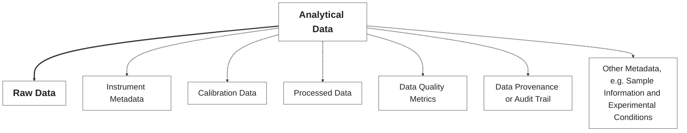

# Origin of Analytical Data

The [*Ishango bone*](https://en.wikipedia.org/wiki/Ishango_bone) is considered the oldest known mathematical artifact.

<figure>
  
  
  <figcaption style="font-size: 0.8em;"><em>The Ishango bone was discovered in the Democratic Republic of Congo, dating back to the Upper Paleolithic period, and is believed to be over 20,000 years old.</em></figcaption>
  <p style="font-size: 0.6em;"><a href="https://en.wikipedia.org/wiki/Ishango_bone">Source: Wikipedia</a></p>
</figure>

---

# Origin of Analytical Data Tools

The [*Abacus*](https://en.wikipedia.org/wiki/Abacus) is one of the oldest known calculating tools, pre-dating modern computing by thousands of years. The Abacus is used for arithmetic processes by representing values in a binary-like manner.

<figure>
  
  
  <figcaption style="font-size: 0.8em;"><em>The Abacus, used for centuries in various cultures approximately since 2400 BC, represents an early form of data processing and calculation.</em></figcaption>
  <p style="font-size: 0.6em;"><a href="https://en.wikipedia.org/wiki/Abacus">Source: Wikipedia</a></p>
</figure>

---

# Evolution of Analytical Data Acquisition

The era of [*analog-to-digital converters (ADCs)*](https://dewesoft.com/blog/history-of-analog-to-digital-converters) revolutionized data acquisition, enabling the conversion of continuous signals into discrete digital data.

<div style="display: flex; align-items: flex-start;">
  <div style="text-align: center;">
    <figure>
      
      <figcaption style="font-size: 0.5em;"><em>The IBM 7700 Data Acquisition System, introduced in the 1960s, was one of the first systems to utilize analog-to-digital conversion for data acquisition.</em></figcaption>
      <p style="font-size: 0.5em;"><a href="https://en.wikipedia.org/wiki/IBM_7700_Data_Acquisition_System">Source: Wikipedia</a></p>
    </figure>
  </div>

  <div style="width: 20px;"></div>

  <div style="text-align: center;">
    <figure>
      
      <figcaption style="font-size: 0.5em;"><em>The Hewlett-Packard GC-MS 5992, introduced in the 1970s, was a pioneering instrument that combined gas chromatography with mass spectrometry, utilizing ADC technology for enhanced analytical capabilities.
      </em></figcaption>
      <p style="font-size: 0.5em;"><a href="https://www.asms.org/docs/history-posters/hp5992.pdf?sfvrsn=2">Source: asms.org</a></p>
    </figure>
  </div>

  <div style="width: 20px;"></div>

  <div style="text-align: center;">
    <figure>
      
      <figcaption style="font-size: 0.5em;"><em>The Agilent 6560 Ion Mobility Q-TOF LC/MS, introduced in the 2010s, represents a modern advancement in analytical data acquisition, integrating ion mobility spectrometry with quadrupole time-of-flight mass spectrometry for enhanced separation and identification of complex mixtures.
      </em></figcaption>
      <p style="font-size: 0.5em;"><a href="https://www.agilent.com/en/product/liquid-chromatography-mass-spectrometry-lc-ms/lc-ms-instruments/quadrupole-time-of-flight-lc-ms/6560-ion-mobility-lc-q-tof">Source: agilent.com</a></p>
    </figure>
  </div>
</div>

---

# Analytical Data (not just Data)

Due to the increased complexity of modern analytical instruments (and experiments), the term 'analytical data' has evolved to encompass more than just raw numerical data.



---

# Use of Analytical Data

<figure>
  
  <figcaption style="font-size: 0.5em;"><em>Analytical data is utilized across various fields, each with unique requirements for data management and structure.</em></figcaption>
  </em></figcaption>
  <p style="font-size: 0.5em;"><a href="https://chatgpt.com/">Source: chatgpt.com</a></p>
</figure>

---

# Analytical Data Management

<div style="display: flex; gap: 5px; align-items: flex-start; flex-wrap: wrap;">
  <div style="flex: 1; min-width: 150px;">

  ```mermaid
  kanban
    Acquisition
      Experimental Setup
      Sample Information
      Instrument Conditions
      Data Formats
      Metadata Capture
  ```
  
  </div>
  <div style="flex: 1; min-width: 150px;">
  
  ```mermaid
  kanban
    Processing
      Cleaning/Preprocessing
      Transformation
      Quality Metrics
      Reproducibility
      Automation
  ```
  
  </div>
  <div style="flex: 1; min-width: 150px;">
  
  ```mermaid
  kanban
    Storage
      Compression/Encoding
      Archiving Strategies
      Accessibility
      Scalability
      Integrity
  ```
  
  </div>
  <div style="flex: 1; min-width: 150px;">
  
  ```mermaid
  kanban
    Provenance
      Audit Trail
      Standard Protocols
      Versioning
      Workflow Management
      Retrospective Analysis
  ```
  
  </div>
  <div style="flex: 1; min-width: 150px;">
  
  ```mermaid
  kanban
    Reporting
      Visualization
      Interpretation
      Collaboration
      Export Formats
      Certification
  ```
  
  </div>
</div>

---

# Structure Variability

Add plots with increasing complexity, e.g., from simple pH time series to LC-UV and finally complex multivariate data, e.g. mass spectrometry data.

<div style="display: flex; gap: 20px; align-items: flex-start;">

  <div style="flex: 1; min-width: 300px;">
    <!-- Content for the first column -->
    First column content here (e.g., a Mermaid diagram, text, or image)
  </div>

  <div style="flex: 1; min-width: 300px;">
    <!-- Content for the second column -->
    Second column content here
  </div>

  <div style="flex: 1; min-width: 300px;">
    <!-- Content for the third column -->
    Third column content here
  </div>

</div>

---

# GCxGC-MS (4 dimensions)

Abstract ilustration of a GCxGC-MS chromatogram, showing the complexity of data with two-dimensional separation and mass spectrometry detection.

---

# Consequences of Complexity

Slide showing which information from pH value is stored in comparison to MS data, highlighting the differences in complexity, volume and variability of data and metadata.

---

# Vendor-Specific Data Formats

Variability of formats for MS data, e.g., Agilent MassHunter, Thermo Xcalibur, Bruker Compass, Waters MassLynx, and others.

---

# The Effots for Accessibility

<figure>
  
  <!-- <figcaption style="font-size: 0.5em;"><em></em></figcaption>
  </em></figcaption>
  <p style="font-size: 0.5em;"><a href="">Source: </a></p> -->
</figure>

---

# Compression and Encoding Streategies

Slide with an overview of different compression and encoding strategies for analytical data.

---

# Compression and Encoding Streategies

Slide with a size comparison of different data formats, giving the example of GC-MS using OpenChrom.

---

# Limited Interoperability

Need for interoperability in data formats. Encoding strategies from vendors as well as the reasons why and how to go around it.

---

# Data standardization

Open data standards opportunities/advantages for tackling lack of data interoperability and how to ensure FAIRness during data handling. Making the work reproducible by working with metadata and standardization of data processing workflows, with benefit of automation and consequently, saving time.

---

# FAIR Data Principles

The FAIR data principles (Findable, Accessible, Interoperable, Reusable) are essential for ensuring that analytical data is managed effectively. They promote the use of standardized formats, metadata, and documentation to enhance data sharing and collaboration across disciplines.

---

# Analytical Data Challenges

Analytical data presents unique challenges due to its complexity, volume, and the need for specialized tools and expertise. These challenges include:

- **Data Management**: The need for efficient data management systems to handle large volumes of data generated by modern analytical instruments.
- **Data Complexity and Volume**: The increasing complexity and size of analytical data require advanced data processing techniques and tools to extract meaningful insights.
- **Data Standardization and Interoperability**:  The lack of standardized data formats and interoperability between different analytical instruments and software can hinder data sharing and collaboration.
- **Data Provenance**: Ensuring data provenance and maintaining an audit trail is crucial for reproducibility and trust in analytical results, supporting FAIR principles.
- **Data Visualization**: Effective visualization techniques are necessary to interpret complex analytical data, enabling researchers to derive insights and communicate findings effectively.
- **Data Quality**: Ensuring data quality through rigorous validation and quality control processes is essential for reliable results. 

# Consequences of Complexity

How diverse the structure of analytical data can be (e.g., multivariate time series from sensors, spectral data and chromatographic profiles).
Highlight challenges arising from complexity and volume of analytical data, including the need for specialized tools and expertise.
Challenges in data management, including data storage, processing, and visualization.
pH can be easily noted from the screen but mass spectrometry data requires specialized software to interpret complex spectra.
The high complexity and size requires compression and efficient storage solutions, as well as advanced data processing techniques to extract meaningful insights.
Show book and size comparison as well as notion of data compression and encoding frameworks.

---