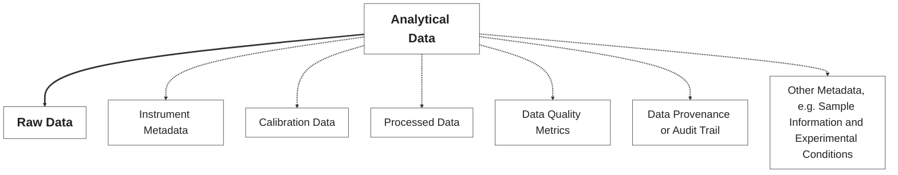
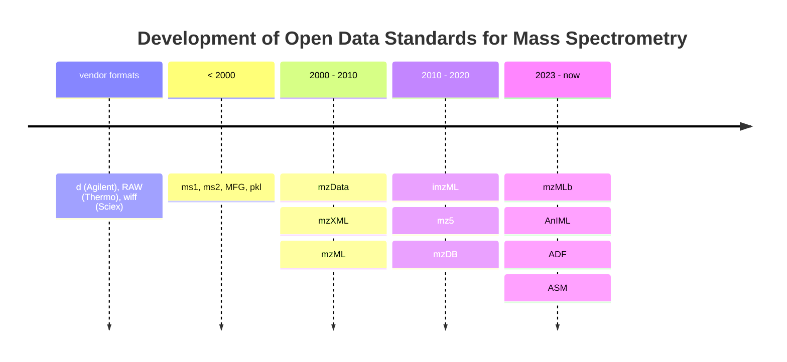

# Origin of Analytical Data

The [*Ishango bone*](https://en.wikipedia.org/wiki/Ishango_bone) is considered the oldest known mathematical artifact.

<figure>
  
  
  <figcaption style="font-size: 0.8em;"><em>The Ishango bone was discovered in the Democratic Republic of Congo, dating back to the Upper Paleolithic period, and is believed to be over 20,000 years old.</em></figcaption>
  <p style="font-size: 0.6em;"><a href="https://en.wikipedia.org/wiki/Ishango_bone">Source: Wikipedia</a></p>
</figure>

---

# Origin of Analytical Data Tools

The [*Abacus*](https://en.wikipedia.org/wiki/Abacus) is one of the oldest known calculating tools, pre-dating modern computing by thousands of years. The Abacus is used for arithmetic processes by representing values in a binary-like manner.

<figure>
  
  
  <figcaption style="font-size: 0.8em;"><em>The Abacus, used for centuries in various cultures approximately since 2400 BC, represents an early form of data processing and calculation.</em></figcaption>
  <p style="font-size: 0.6em;"><a href="https://en.wikipedia.org/wiki/Abacus">Source: Wikipedia</a></p>
</figure>

---

# Evolution of Analytical Data Acquisition

The era of [*analog-to-digital converters (ADCs)*](https://dewesoft.com/blog/history-of-analog-to-digital-converters) revolutionized data acquisition, enabling the conversion of continuous signals into discrete digital data.

<div style="display: flex; align-items: flex-start;">
  <div style="text-align: center;">
    <figure>
      
      <figcaption style="font-size: 0.5em;"><em>The IBM 7700 Data Acquisition System, introduced in the 1960s, was one of the first systems to utilize analog-to-digital conversion for data acquisition.</em></figcaption>
      <p style="font-size: 0.5em;"><a href="https://en.wikipedia.org/wiki/IBM_7700_Data_Acquisition_System">Source: Wikipedia</a></p>
    </figure>
  </div>

  <div style="width: 20px;"></div>

  <div style="text-align: center;">
    <figure>
      
      <figcaption style="font-size: 0.5em;"><em>The Hewlett-Packard GC-MS 5992, introduced in the 1970s, was a pioneering instrument that combined gas chromatography with mass spectrometry, utilizing ADC technology for enhanced analytical capabilities.
      </em></figcaption>
      <p style="font-size: 0.5em;"><a href="https://www.asms.org/docs/history-posters/hp5992.pdf?sfvrsn=2">Source: asms.org</a></p>
    </figure>
  </div>

  <div style="width: 20px;"></div>

  <div style="text-align: center;">
    <figure>
      
      <figcaption style="font-size: 0.5em;"><em>The Agilent 6560 Ion Mobility Q-TOF LC/MS, introduced in the 2010s, represents a modern advancement in analytical data acquisition, integrating ion mobility spectrometry with quadrupole time-of-flight mass spectrometry for enhanced separation and identification of complex mixtures.
      </em></figcaption>
      <p style="font-size: 0.5em;"><a href="https://www.agilent.com/en/product/liquid-chromatography-mass-spectrometry-lc-ms/lc-ms-instruments/quadrupole-time-of-flight-lc-ms/6560-ion-mobility-lc-q-tof">Source: agilent.com</a></p>
    </figure>
  </div>
</div>

---

# Analytical Data (not just Data)

Due to the increased complexity of modern analytical instruments (and experiments), the term 'analytical data' has evolved to encompass more than just raw numerical data.



---

# Use of Analytical Data

<figure>
  
  <figcaption style="font-size: 0.8em;"><em>Analytical data is utilized across various fields, each with unique requirements for data management and structure.</em></figcaption>
  </em></figcaption>
  <p style="font-size: 0.5em;"><a href="https://chatgpt.com/">Source: chatgpt.com</a></p>
</figure>

---

# Analytical Data Management

<div style="display: flex; gap: 5px; align-items: flex-start; flex-wrap: wrap;height: 100%;">
  <div style="flex: 1; min-width: 150px;">

  ```mermaid
  kanban
    Acquisition
      Experimental Setup
      Sample Information
      Instrument Conditions
      Data Formats
      Metadata Capture
  ```
  
  </div>
  <div style="flex: 1; min-width: 150px;">
  
  ```mermaid
  kanban
    Processing
      Cleaning/Preprocessing
      Transformation
      Quality Metrics
      Reproducibility
      Automation
  ```
  
  </div>
  <div style="flex: 1; min-width: 150px;">
  
  ```mermaid
  kanban
    Storage
      Compression/Encoding
      Archiving Strategies
      Accessibility
      Scalability
      Integrity
  ```
  
  </div>
  <div style="flex: 1; min-width: 150px;">
  
  ```mermaid
  kanban
    Provenance
      Audit Trail
      Standard Protocols
      Versioning
      Workflow Management
      Retrospective Analysis
  ```
  
  </div>
  <div style="flex: 1; min-width: 150px;">
  
  ```mermaid
  kanban
    Reporting
      Visualization
      Interpretation
      Collaboration
      Export Formats
      Certification
  ```
  
  </div>
</div>

---

# Do you what to know more?

<div style="display: flex; gap: 5px; align-items: center; justify-content: center; flex-wrap: wrap; height: 100%;">
  <div style="flex: 1; min-width: 300px; display: flex; justify-content: center; align-items: center;">
    <figure style="margin: 0;">
      
    </figure>
  </div>
  <div style="flex: 1; min-width: 300px; display: flex; justify-content: center; align-items: center; text-align: justify;">
    <span>
      Provides an essential source of information and guidance on practical implementation on topics related to digitization and automation for all points in the laboratory value chain.<br>
      <br>
      <br>
      <figcaption style="font-size: 0.5em;"><em>Teutenberg et al.<br>ISBN: 978-3-527-35265-4<br>September 2025</em></figcaption>
    </span>
  </div>
</div>

---

# Structure Variability

<div style="display: flex; justify-content: center; align-items: center; flex-wrap: wrap; height: 100%;">
  <div style="display: flex; flex-direction: row; align-items: flex-end; min-width: 300px;">
    <figure style="margin: 0;">
      
    </figure>
    <figcaption style="font-size: 0.5em; margin: 0 0 8px 16px; align-self: flex-end;">
      <a href="https://www.iuta.de/forschung/analytik-messtechnik/futurelab-nrw/" target="_blank" style="text-decoration:none; color:#00d0ff;">
        FutureLab.NRW
      </a>
    </figcaption>
  </div>
</div>

---

# Structure Variability

<div style="display: flex; justify-content: center; align-items: center;">
  <div id="BVCZ_pHPlot" style="width:920px;height:400px;"></div>
</div>
<script>
  const samples = Array.from({length: 18}, (_, i) => i + 1);
  const mean = 7;
  const stddev = 0.7;
  let pH = Array.from({length: 17}, () =>
    Math.min(14, Math.max(1, (mean + stddev * (Math.random() * 2 - 1)).toFixed(2)))
  );
  // Insert an outlier at a random position
  const outlier = (Math.random() > 0.5) ? 1.2 : 13.5;
  const outlierIndex = Math.floor(Math.random() * 18);
  pH.splice(outlierIndex, 0, outlier.toFixed(2));
  const trace = {
    x: samples,
    y: pH,
    type: 'scatter',
    mode: 'lines+markers',
    name: 'pH',
    marker: { color: '#00d0ff' },
    line: { color: '#00d0ff' }
  };
  const layout = {
    title: {
      text: 'pH Value of 18 Samples',
      font: { color: '#fff' }
    },
    xaxis: {
      title: {
        text: 'Sample',
        color: '#fff'
      },
      color: '#fff',
      linecolor: '#fff',
      tickcolor: '#fff'
    },
    yaxis: {
      title: {
        text: 'pH',
        color: '#fff'
      },
      color: '#fff',
      range: [0, 14],
      linecolor: '#fff',
      tickcolor: '#fff'
    },
    legend: {
      font: {
        color: '#fff'
      }
    },
    plot_bgcolor: '#000000',
    paper_bgcolor: '#000000',
    font: { color: '#fff' }
  };
  Reveal.on('slidechanged', function(event) {
    if (event.currentSlide.querySelector('#BVCZ_pHPlot')) {
      Plotly.newPlot('BVCZ_pHPlot', [trace], layout);
    }
  });
</script>
---

# Structure Variability

<div style="display: flex; justify-content: center; align-items: center;">
  <div id="BVCZ_chromDADPlot" style="width:920px;height:400px;"></div>
</div>
<script>
  Reveal.on('slidechanged', function(event) {
    if (event.currentSlide.querySelector('#BVCZ_chromDADPlot')) {
      d3.csv('resources/data/01_analyticalDataChallenges/DAD_BVCZ_Chromatograms.csv').then(function(data) {
        const groups = {};
        data.forEach(row => {
          const analysis = row.analysis;
          if (!groups[analysis]) {
            groups[analysis] = { x: [], y: [] };
          }
          groups[analysis].x.push(Number(row.rt));
          groups[analysis].y.push(Number(row.intensity));
        });
        const traces = Object.keys(groups).map(analysis => ({
          x: groups[analysis].x,
          y: groups[analysis].y,
          mode: 'lines',
          name: analysis,
          type: 'scatter'
        }));
        const layout = {
          title: {
            text: 'Monoclonal Antibody Bevacizumab LC-DAD (214,4 nm) Chromatograms of 18 Analyses',
            font: { color: '#fff' }
          },
          xaxis: {
            title: {
              text: 'Retention Time / seconds',
              color: '#fff'
            },
            color: '#fff',
            linecolor: '#fff',
            tickcolor: '#fff'
          },
          yaxis: {
            title: {
              text: 'Absorbance / u.a.',
              color: '#fff'
            },
            color: '#fff',
            linecolor: '#fff',
            tickcolor: '#fff'
          },
          legend: {
            font: {
              color: '#fff'
            }
          },
          plot_bgcolor: '#000000',
          paper_bgcolor: '#000000',
          font: { color: '#fff' }
        };
        Plotly.newPlot('BVCZ_chromDADPlot', traces, layout, {responsive: true, scrollZoom: true});
      });
    }
  });
</script>

---

# Structure Variability

<div style="display: flex; justify-content: center; align-items: center;">
  <div id="BVCZ_ms3dPlot" style="width:920px;height:400px;"></div>
</div>
<script>
  Reveal.on('slidechanged', function(event) {
    if (event.currentSlide.querySelector('#BVCZ_ms3dPlot')) {
      d3.csv('resources/data/01_analyticalDataChallenges/MS_BVCZ_Spectra.csv').then(function(data) {
        const groups = {};
        data.forEach(row => {
          const group = `${row.rt}`;
          if (!groups[group]) {
            groups[group] = { x: [], y: [], z: []};
          }
          groups[group].x.push(Number(row.rt));
          groups[group].y.push(Number(row.mz));
          groups[group].z.push(Number(row.intensity));
        });
        const traces = Object.keys(groups).map(group => ({
          x: groups[group].x,
          y: groups[group].y,
          z: groups[group].z,
          mode: 'lines',
          type: 'scatter3d',
          name: group,
          showlegend: false,
        }));
        const layout = {
          title: {
            text: 'Monoclonal Antibody Bevacizumab LC-HRMS Spectra',
            font: { color: '#fff' }
          },
          scene: {
            xaxis: {
              title: {
                text: 'Retention Time / seconds',
                color: '#fff'
              },
              color: '#fff',
              linecolor: '#fff',
              tickcolor: '#fff'
            },
            yaxis: {
              title: {
                text: '*m/z*',
                color: '#fff'
              },
              color: '#fff',
              linecolor: '#fff',
              tickcolor: '#fff'
            },
            zaxis: {
              title: {
                text: 'Intensity / Counts',
                color: '#fff'
              },
              color: '#fff',
              linecolor: '#fff',
              tickcolor: '#fff'
            }
          },
          legend: {
            font: {
              color: '#fff'
            }
          },
          plot_bgcolor: '#000000',
          paper_bgcolor: '#000000',
          font: { color: '#fff' },
          autosize: false,
          width: 900,
          height: 400,
          margin: {
            l: 0,
            r: 0,
            b: 0,
            t: 40,
            pad: 0
          },
        };
        Plotly.newPlot('BVCZ_ms3dPlot', traces, layout, {responsive: true, scrollZoom: true});
      });
    }
  });
</script>

---

# Structure Variability

<div style="display: flex; justify-content: center; align-items: center;">
  <div id="BVCZ_ProcessedPlot" style="width:750px;height:400px;"></div>
  <div style="text-align:center; vertical-align:middle;">
  <a href="https://odea-project.github.io/StreamFind/articles/index.html" target="_blank" style="color:#00d0ff;">
    More details in<br>articles section of<br>odea-project.github.io/StreamFind
  </a>
  </div>
</div>
<script>
  Reveal.on('slidechanged', function(event) {
    if (event.currentSlide.querySelector('#BVCZ_ProcessedPlot')) {
      d3.csv('resources/data/01_analyticalDataChallenges/MS_BVCZ_Spectra_Processed.csv').then(function(data) {
        const groups = {};
        data.forEach(row => {
          const analysis = row.analysis;
          if (!groups[analysis]) {
            groups[analysis] = { x: [], y: [] };
          }
          groups[analysis].x.push(Number(row.mass));
          groups[analysis].y.push(Number(row.intensity));
        });
        const traces = Object.keys(groups).map(analysis => ({
          x: groups[analysis].x,
          y: groups[analysis].y,
          mode: 'lines',
          name: analysis,
          type: 'scatter'
        }));
        const layout = {
          title: {
            text: 'Processed Monoclonal Antibody Bevacizumab LC-HRMS Spectra',
            font: { color: '#fff' }
          },
          xaxis: {
            title: {
              text: 'Mass / Da',
              color: '#fff'
            },
            color: '#fff',
            linecolor: '#fff',
            tickcolor: '#fff'
          },
          yaxis: {
            title: {
              text: 'Intensity / Counts',
              color: '#fff'
            },
            color: '#fff',
            linecolor: '#fff',
            tickcolor: '#fff'
          },
          legend: {
            font: {
              color: '#fff'
            }
          },
          plot_bgcolor: '#000000',
          paper_bgcolor: '#000000',
          font: { color: '#fff' }
        };
        Plotly.newPlot('BVCZ_ProcessedPlot', traces, layout, {responsive: true, scrollZoom: true});
      });
    }
  });
</script>

---

# Hands-on Exercise

<div style="display: flex; justify-content: center; align-items: center; flex-wrap: wrap; height: 100%;">
  <div style="display: flex; flex-direction: row; align-items: flex-end; min-width: 300px;">
    <figure style="margin: 0;">
      
    </figure>
    <figcaption style="font-size: 0.5em; margin: 0 0 8px 16px; align-self: flex-end;">
      <a href="https://www.iuta.de/forschung/analytik-messtechnik/futurelab-nrw/" target="_blank" style="text-decoration:none; color:#00d0ff;">
        Thissen et al. (2025) Accepted<br>
        Analytical and Bioanalytical Chemistry
      </a>
    </figcaption>
  </div>
</div>

---

# Hands-on Exercise Data

<div style="display: flex; justify-content: center; align-items: center;">
  <div id="SEC_CERS_Plot" style="width:900px;height:400px;"></div>
</div>
<script>
  Reveal.on('slidechanged', function(event) {
    if (event.currentSlide.querySelector('#SEC_CERS_Plot')) {
      console.log("Loading SEC-CERS dataset...");
      d3.csv('resources/data/01_analyticalDataChallenges/SEC_CERS_Dataset.csv').then(function(data) {
        const analyses = [...new Set(data.map(row => row.analysis))];
        const rtTraces = [];
        const shiftTraces = [];
        analyses.forEach(analysis => {
          const filtered = data.filter(row => row.replicate === "Avastin" && row.analysis === analysis);
          // 1. RT vs cumulative intensity
          const rtMap = new Map();
          filtered.forEach(row => {
            const rt = Number(row.rt);
            const intensity = Number(row.intensity);
            rtMap.set(rt, (rtMap.get(rt) || 0) + intensity);
          });
          const rtX = Array.from(rtMap.keys()).sort((a, b) => a - b);
          const rtY = rtX.map(rt => rtMap.get(rt));
          rtTraces.push({
            x: rtX,
            y: rtY,
            mode: 'lines',
            name: analysis,
            type: 'scatter',
            xaxis: 'x1',
            yaxis: 'y1'
          });
          // 2. Shift vs average intensity
          const shiftMap = new Map();
          const shiftCount = new Map();
          filtered.forEach(row => {
            const shift = Number(row.shift);
            const intensity = Number(row.intensity);
            shiftMap.set(shift, (shiftMap.get(shift) || 0) + intensity);
            shiftCount.set(shift, (shiftCount.get(shift) || 0) + 1);
          });
          const shiftX = Array.from(shiftMap.keys()).sort((a, b) => a - b);
          const shiftY = shiftX.map(shift => shiftMap.get(shift) / shiftCount.get(shift));
          shiftTraces.push({
            x: shiftX,
            y: shiftY,
            mode: 'lines',
            name: analysis,
            type: 'scatter',
            xaxis: 'x2',
            yaxis: 'y2',
            showlegend: false
          });
        });
        const layout = {
          grid: {rows: 1, columns: 2, pattern: 'independent'},
          plot_bgcolor: '#000000',
          paper_bgcolor: '#000000',
          font: {color: '#fff'},
          xaxis: {
            title: {text: '"Elution volume / ml', color: '#fff'},
            color: '#fff',
            linecolor: '#fff',
            tickcolor: '#fff'
          },
          yaxis: {
            title: {text: 'Cumulative Raman intensity / A.U.', color: '#fff'},
            color: '#fff',
            linecolor: '#fff',
            tickcolor: '#fff'
          },
          xaxis2: {
            title: {text: 'Raman shift / cm<sup>-1</sup>', color: '#fff'},
            color: '#fff',
            linecolor: '#fff',
            tickcolor: '#fff'
          },
          yaxis2: {
            title: {text: 'Averaged Intensity / U.A.', color: '#fff'},
            color: '#fff',
            linecolor: '#fff',
            tickcolor: '#fff'
          },
          legend: {
            font: {color: '#fff'}
          },
          title: {
            text: 'SEC-CERS Dataset: Avastin',
            font: {color: '#fff'}
          }
        };
        Plotly.newPlot('SEC_CERS_Plot', [...rtTraces, ...shiftTraces], layout, {responsive: true, scrollZoom: true});
      });
    }
  });
</script>

---

# Consequences of Complexity

The greater the complexity of the analytical data, the more sophisticated the tools and expertise required for its management, processing and interpretation.

<div>
  <div class="leftBox">
    <p class="mainBullet"><strong>pH Measurement</strong></p>
    <ul style="font-size: 70%;">
      <li><strong>Data</strong>
        <ul>
          <li>Single value (pH)</li>
          <li>Temperature</li>
        </ul>
      </li>
      <li>Sample ID</li>
      <li>Sensor ID</li>
      <li>Calibration info</li>
      <li>Other Provenance Metadata</li>
    </ul>
  </div>
  <div class="spacer"></div>
  <div class="rightBox">
    <p class="mainBullet"><strong>LC-HRMS Measurement</strong></p>
    <ul style="font-size: 70%;">
      <li>Data
        <ul>
          <li>Retention time</li>
          <li>Spectra (m/z, intensity)</li>
          <li>MS Level</li>
          <li>Isolation window</li>
          <li>Chromatograms (i.e., TIC, BPC)</li>
        </ul>
      </li>
      <li>Sample ID</li>
      <li>Instrument IDs (i.e., LC, Column, MS, etc.)</li>
      <li>Separation/Acquisition Metadata
        <ul>
          <li>Ionization mode</li>
          <li>Mobile phase composition</li>
        </ul>
      </li>
      <li>Calibration info</li>
      <li>Other Provenance Metadata</li>
    </ul>
  </div>
</div>

---

# The Efforts for Accessibility



[> 2000](https://pmc.ncbi.nlm.nih.gov/articles/PMC3518119/), 
[mzData](http://tools.proteomecenter.org/formats/mzData/mzdata_xmlspy_docs.html), 
[mzXML](http://tools.proteomecenter.org/wiki/index.php?title=Formats:mzXML), 
[mzML](https://peptideatlas.org/tmp/mzML1.1.0.html), 
[mz5](https://pubmed.ncbi.nlm.nih.gov/21960719/), 
[mzDB](https://pmc.ncbi.nlm.nih.gov/articles/PMC4349994/), 
[mzMLb](https://pubs.acs.org/doi/10.1021/acs.jproteome.0c00192), 
[AnIML](https://www.animl.org/)
[ADF](https://docs.allotrope.org/Allotrope%20Data%20Format.html), 
[ASM](https://www.allotrope.org/asm).

---

# Compression and Encoding Streategies

<div style="display: flex; justify-content: center; align-items: center;">
  <div id="formatSizeBarPlot" style="width:800px;height:400px;"></div>
  <div style="text-align:center; font-size:0.8em; margin-top: 8px;width:200px;">
    <em>
      Size comparison of different open data standards using, as an example, a GC-MS data file. The original file was converted from the ChemStation of Agilent to the different open formats with OpenChrom® from Lablicate GmbH.
    </em>
  </div>
</div>
<script>
  const file_formats = [
    "D", "ADF", "mz5", "mzXML", "ASM", "AnIML", "mzML"
  ];
  const file_formats_sizes = [2.08, 3.4, 3.6, 4.8, 9.1, 11.4, 15];
  const file_formats_trace = {
    x: file_formats,
    y: file_formats_sizes,
    type: 'bar',
    marker: { color: '#00d0ff' }
  };
  const file_formats_layout = {
    title: {
      text: 'File Size by Format',
      font: { color: '#fff' }
    },
    xaxis: {
      title: { text: 'Format', color: '#fff' },
      color: '#fff',
      linecolor: '#fff',
      tickcolor: '#fff'
    },
    yaxis: {
      title: { text: 'Size (MB)', color: '#fff' },
      color: '#fff',
      linecolor: '#fff',
      tickcolor: '#fff'
    },
    plot_bgcolor: '#000000',
    paper_bgcolor: '#000000',
    font: { color: '#fff' }
  };
  Reveal.on('slidechanged', function(event) {
    if (event.currentSlide.querySelector('#formatSizeBarPlot')) {
      Plotly.newPlot('formatSizeBarPlot', [file_formats_trace], file_formats_layout);
    }
  });
</script>

---

# FAIR Data Principles

The FAIR (Findable, Accessible, Interoperable, Reusable) principles are essential for effective analytical data management and promote the use of standardized formats, metadata, and documentation to enhance data sharing and collaboration across disciplines.

<figure>
  
  <p style="font-size: 0.6em;"><a href="https://knowledgebase.nfdi4chem.de/knowledge_base/docs/fair/">Source: NFDI4Chem</a></p>
</figure>

---

# Analytical Data Challenges

Analytical data presents unique challenges due to its complexity, volume, and the need for specialized tools and expertise. These challenges include:

- **Data Management**: The need for efficient data management systems to handle large volumes of data generated by modern analytical instruments.
- **Data Complexity and Volume**: The increasing complexity and size of analytical data require advanced data processing techniques and tools to extract meaningful insights.
- **Data Standardization and Interoperability**:  The lack of standardized data formats and interoperability between different analytical instruments and software can hinder data sharing and collaboration.
- **Data Provenance**: Ensuring data provenance and maintaining an audit trail is crucial for reproducibility and trust in analytical results, supporting FAIR principles.
- **Data Visualization**: Effective visualization techniques are necessary to interpret complex analytical data, enabling researchers to derive insights and communicate findings effectively.
- **Data Quality**: Ensuring data quality through rigorous validation and quality control processes is essential for reliable results. 
