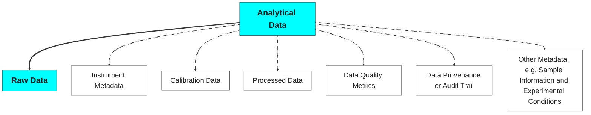
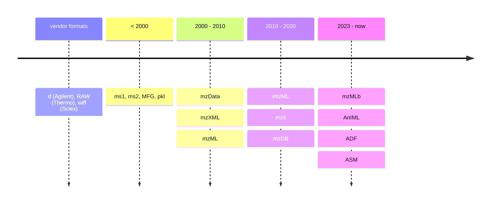

## Analytical Data <span class="post-it-strip">origin</span>

The [*Ishango bone*](https://en.wikipedia.org/wiki/Ishango_bone) is considered the oldest known mathematical artifact.

<figure>
  
  
  <figcaption style="font-size: 0.6em;"><em>The Ishango bone was discovered in the Democratic Republic of Congo, dating back to the Upper Paleolithic period, and is believed to be over 20,000 years old.</em></figcaption>
  <p style="font-size: 0.5em;">Source: <a href="https://en.wikipedia.org/wiki/Ishango_bone">Wikipedia</a></p>
</figure>

---

## Analytical Data <span class="post-it-strip">tools</span>

The [*Abacus*](https://en.wikipedia.org/wiki/Abacus) is one of the oldest known calculating tools, pre-dating modern computing by thousands of years. The Abacus is used for arithmetic processes by representing values in a binary-like manner.

<figure>
  
  
  <figcaption style="font-size: 0.6em;"><em>The Abacus, used for centuries in various cultures approximately since 2400 BC, represents an early form of data processing and calculation.</em></figcaption>
  <p style="font-size: 0.5em;">Source: <a href="https://en.wikipedia.org/wiki/Abacus">Wikipedia</a></p>
</figure>

---

## Analytical Data <span class="post-it-strip">acquisition</span>

The era of [*analog-to-digital converters (ADCs)*](https://dewesoft.com/blog/history-of-analog-to-digital-converters) revolutionized data acquisition, enabling the conversion of continuous signals into discrete digital data.

<div style="display: flex; justify-content: center; align-items: flex-start; gap: 10px;">
  <div style="text-align: center; width: 300px;">
    <figure>
      
      <figcaption style="font-size: 0.5em;"><em>The IBM 7700 Data Acquisition System, introduced in the 1960s, was one of the first systems to utilize analog-to-digital conversion for data acquisition.</em></figcaption>
      <p style="font-size: 0.5em;">Source: <a href="https://en.wikipedia.org/wiki/IBM_7700_Data_Acquisition_System">Wikipedia</a></p>
    </figure>
  </div>
  <div style="text-align: center; width: 300px;">
    <figure>
      
      <figcaption style="font-size: 0.5em;"><em>The Hewlett-Packard GC-MS 5992, introduced in the 1970s, was a pioneering instrument that combined gas chromatography with mass spectrometry, utilizing ADC technology for enhanced analytical capabilities.
      </em></figcaption>
      <p style="font-size: 0.5em;">Source: <a href="https://www.asms.org/docs/history-posters/hp5992.pdf?sfvrsn=2">asms.org</a></p>
    </figure>
  </div>
  <div style="text-align: center; width: 300px;">
    <figure>
      
      <figcaption style="font-size: 0.5em;"><em>The Agilent 6560 Ion Mobility Q-TOF LC/MS, introduced in the 2010s, represents a modern advancement in analytical data acquisition, integrating ion mobility spectrometry with quadrupole time-of-flight mass spectrometry for enhanced separation and identification of complex mixtures.
      </em></figcaption>
      <p style="font-size: 0.5em;">Source: <a href="https://www.agilent.com/en/product/liquid-chromatography-mass-spectrometry-lc-ms/lc-ms-instruments/quadrupole-time-of-flight-lc-ms/6560-ion-mobility-lc-q-tof">agilent.com</a></p>
    </figure>
  </div>
</div>

---

## Analytical Data <span class="post-it-strip">not just Data!</span>

Due to the increased complexity of modern analytical instruments (and experiments), the term 'analytical data' has evolved to encompass more than just raw numerical data.



---

## Analytical Data <span class="post-it-strip">fields</span>

Analytical data is utilized across various fields, each with unique requirements for data management.

<figure>
  
  <p style="font-size: 0.5em;">Figures source: <a href="https://chatgpt.com/">chatgpt.com</a></p>
</figure>

---

## Analytical Data <span class="post-it-strip">management</span>

<div style="display: flex; gap: 5px; align-items: flex-start; flex-wrap: wrap;height: 100%;">
  <div style="flex: 1; min-width: 150px;">

  ```mermaid
  kanban
    Acquisition
      Experimental Setup
      Sample Information
      Instrument Conditions
      Data Formats
      Metadata Capture
  ```
  
  </div>
  <div class="fragment" style="flex: 1; min-width: 150px;">
  
  ```mermaid
  kanban
    Processing
      Cleaning/Preprocessing
      Transformation
      Quality Metrics
      Reproducibility
      Automation
  ```
  
  </div>
  <div class="fragment" style="flex: 1; min-width: 150px;">
  
  ```mermaid
  kanban
    Storage
      Compression/Encoding
      Archiving Strategies
      Accessibility
      Scalability
      Integrity
  ```
  
  </div>
  <div class="fragment" style="flex: 1; min-width: 150px;">
  
  ```mermaid
  kanban
    Provenance
      Audit Trail
      Standard Protocols
      Versioning
      Workflow Management
      Retrospective Analysis
  ```
  
  </div>
  <div class="fragment" style="flex: 1; min-width: 150px;">
  
  ```mermaid
  kanban
    Reporting
      Visualization
      Interpretation
      Collaboration
      Export Formats
      Certification
  ```
  
  </div>
</div>

---

## Analytical Data <span class="post-it-strip">challenges</span>

<figure>
  
  <p style="font-size: 0.7em;">Sources: 
  <a href="https://theanalyticalscientist.com/issues/2023/articles/apr/demystifying-analytical-data-management">theanalyticalscientist.com</a> and <a href="https://bit.ly/3ZNKQkf">ACD/Labs, The Analytical Data Management Report 2022</a>
  </p>
</figure>
<!-- https://theanalyticalscientist.videomarketingplatform.co/secret/83973388/a59993e289845aebb1a1e73d2bb282e6 -->

---

## Further reading

<div style="display: flex; justify-content: center; align-items: center; gap: 10px;">
  <div style="width: 300px;">
    <figure style="margin: 0;">
      
    </figure>
  </div>
  <div style="width: 350px; text-align: justify;">
    <p>
      Provides an essential source of information and guidance on practical implementation on topics related to digitization and automation for all points in the laboratory value chain.<br>
      <br>
      <br>
      <figcaption style="font-size: 0.5em;"><em>Teutenberg et al.<br>ISBN: 978-3-527-35265-4<br>September 2025</em></figcaption>
    </p>
  </div>
</div>

---

## Analytical Data <span class="post-it-strip">heterogeneity</span>

<div style="display: flex; justify-content: center; align-items: center;">
  <div class="tab-content active lab-figure-tab" data-tab="lab-figure" style="position: relative;height:400px">
    <figure>
      
    </figure>
    <a href="https://www.iuta.de/forschung/analytik-messtechnik/futurelab-nrw/" style="font-size: 0.6em; position: absolute; top: 5%; left: 50%; transform: translate(-50%, -50%); text-align: center;">
        FutureLab.NRW
    </a>
  </div>
  <!-- @Gerrit the processed plots could appear after pressing a slide bottom instead of adding the tab bottoms -->
  <!-- @Gerrit in the processed plot for the LC-DAD why is the hover info with black font even when I set to white? Problem with conflicting CSS? -->
  <div id="BVCZ_pH_plot" class="tab-content signal BVCZ_pH_plot-tab" data-tab="BVCZ_pH_plot" style="width:920px;height:400px;"></div>
  <div id="BVCZ_DAD_plot" class="tab-content signal BVCZ_DAD_plot-tab" data-tab="BVCZ_DAD_plot" style="width:920px;height:400px;"></div>
  <div id="Processed_BVCZ_DAD_plot" class="tab-content signal Processed_BVCZ_DAD_plot-tab" data-tab="Processed_BVCZ_DAD_plot" style="width:920px;height:400px;"></div>
  <div id="BVCZ_HRMS_plot" class="tab-content signal BVCZ_HRMS_plot-tab" data-tab="BVCZ_HRMS_plot" style="width:920px;height:400px;"></div>
  <div id="Processed_BVCZ_HRMS_plot" class="tab-content signal Processed_BVCZ_HRMS_plot-tab" data-tab="Processed_BVCZ_HRMS_plot" style="position: relative;">
    <div id="BVCZ_ProcessedPlot" style="width:920px;height:400px;"></div>
    <a href="https://odea-project.github.io/StreamFind/articles/index.html" style="font-size: 0.6em; position: absolute; top: 20%; left: 50%; transform: translate(-50%, -50%); text-align: center;">
        More details in articles section of odea-project.github.io/StreamFind
    </a>
  </div>
</div>
<div class="tabs">
  <div class="tab active lab-figure-tab" data-tab="lab-figure">Lab</div>
  <div class="tab signal BVCZ_pH_plot-tab" data-tab="BVCZ_pH_plot">pH</div>
  <div class="tab signal BVCZ_DAD_plot-tab" data-tab="BVCZ_DAD_plot">LC-DAD</div>
  <div class="tab signal Processed_BVCZ_DAD_plot-tab" data-tab="Processed_BVCZ_DAD_plot">Processed LC-DAD</div>
  <div class="tab signal BVCZ_HRMS_plot-tab" data-tab="BVCZ_HRMS_plot">LC-HRMS</div>
  <div class="tab signal Processed_BVCZ_HRMS_plot-tab" data-tab="Processed_BVCZ_HRMS_plot">Processed LC-HRMS</div>
</div>

<!-- MARK: pH plot -->
<script>
  const samples = Array.from({length: 20}, (_, i) => i + 1);
  const mean = 7;
  const stddev = 0.7;
  let pH = Array.from({length: 19}, () =>
    Math.min(14, Math.max(1, (mean + stddev * (Math.random() * 2 - 1)).toFixed(2)))
  );
  const outlier = (Math.random() > 0.5) ? 1.2 : 13.5;
  const outlierIndex = Math.floor(Math.random() * 20);
  pH.splice(outlierIndex, 0, outlier.toFixed(2));
  const trace = {
    x: samples,
    y: pH,
    type: 'scatter',
    mode: 'lines+markers',
    name: 'pH',
    marker: { color: '#00d0ff' },
    line: { color: '#00d0ff' }
  };
  const layout = {
    title: {
      text: 'pH Value of 20 Samples',
      font: { color: '#fff' }
    },
    xaxis: {
      title: {
        text: 'Sample',
        color: '#fff'
      },
      color: '#fff',
      linecolor: '#fff',
      tickcolor: '#fff'
    },
    yaxis: {
      title: {
        text: 'pH',
        color: '#fff'
      },
      color: '#fff',
      range: [0, 14],
      linecolor: '#fff',
      tickcolor: '#fff'
    },
    legend: {
      font: {
        color: '#fff'
      }
    },
    plot_bgcolor: '#000000',
    paper_bgcolor: '#000000',
    font: { color: '#fff' }
  };
  Reveal.on('slidechanged', function(event) {
    if (event.currentSlide.querySelector('#BVCZ_pH_plot')) {
      Plotly.newPlot('BVCZ_pH_plot', [trace], layout);
    }
  });
</script>

<!-- MARK: Raw LC-DAD Plot -->
<script>
  Reveal.on('slidechanged', function(event) {
    if (event.currentSlide.querySelector('#BVCZ_DAD_plot')) {
      d3.csv('resources/data/01_analyticalDataChallenges/DAD_BVCZ_Chromatograms.csv').then(function(data) {
        const groups = {};
        data.forEach(row => {
          const analysis = row.analysis;
          if (!groups[analysis]) {
            groups[analysis] = { x: [], y: [] };
          }
          groups[analysis].x.push(Number(row.rt));
          groups[analysis].y.push(Number(row.intensity));
        });
        const traces = Object.keys(groups).map(analysis => ({
          x: groups[analysis].x,
          y: groups[analysis].y,
          mode: 'lines',
          name: analysis,
          type: 'scatter'
        }));
        const layout = {
          title: {
            text: 'Monoclonal Antibody Bevacizumab LC-DAD (214,4 nm) Chromatograms of 18 Analyses',
            font: { color: '#fff' }
          },
          xaxis: {
            title: {
              text: 'Retention Time / seconds',
              color: '#fff'
            },
            color: '#fff',
            linecolor: '#fff',
            tickcolor: '#fff'
          },
          yaxis: {
            title: {
              text: 'Absorbance / U.A.',
              color: '#fff'
            },
            color: '#fff',
            linecolor: '#fff',
            tickcolor: '#fff'
          },
          legend: {
            font: {
              color: '#fff'
            }
          },
          plot_bgcolor: '#000000',
          paper_bgcolor: '#000000',
          font: { color: '#fff' }
        };
        Plotly.newPlot('BVCZ_DAD_plot', traces, layout, {responsive: true, scrollZoom: true});
      });
    }
  });
</script>

<!-- MARK: Processed LC-DAD Plot -->
<script>
  Reveal.on('slidechanged', function(event) {
    if (event.currentSlide.querySelector('#Processed_BVCZ_DAD_plot')) {
      Promise.all([
        d3.csv('resources/data/01_analyticalDataChallenges/DAD_BVCZ_Processed_Chromatograms.csv'),
        d3.csv('resources/data/01_analyticalDataChallenges/DAD_BVCZ_chrompeaks.csv')
      ]).then(function([data, peaks]) {
        const groups = {};
        data.forEach(row => {
          const analysis = row.analysis;
          if (!groups[analysis]) {
            groups[analysis] = { x: [], y: [] };
          }
          groups[analysis].x.push(Number(row.rt));
          groups[analysis].y.push(Number(row.intensity));
        });
        const analysisNames = Object.keys(groups);
        const palette = [
          '#00d0ff', '#ff7f0e', '#2ca02c', '#d62728', '#9467bd', '#8c564b',
          '#e377c2', '#7f7f7f', '#bcbd22', '#17becf', '#1f77b4', '#ffbb78',
          '#98df8a', '#ff9896', '#c5b0d5', '#c49c94', '#f7b6d2', '#c7c7c7'
        ];
        const colorMap = {};
        analysisNames.forEach((name, i) => {
          colorMap[name] = palette[i % palette.length];
        });
        const traces = Object.keys(groups).map(analysis => ({
          x: groups[analysis].x,
          y: groups[analysis].y,
          mode: 'lines',
          name: analysis,
          legendgroup: analysis,
          showlegend: false,
          type: 'scatter',
          line: {width: 1, color: colorMap[analysis] }
        }));
        const fillTraces = peaks.map(peak => {
          const analysis = peak.analysis;
          const rtmin = Number(peak.rtmin);
          const rtmax = Number(peak.rtmax);
          if (!groups[analysis]) return null;
          const region = groups[analysis].x
            .map((x, i) => ({ x, y: groups[analysis].y[i] }))
            .filter(pt => pt.x >= rtmin && pt.x <= rtmax);
          if (region.length === 0) return null;
          return {
            x: region.map(pt => pt.x),
            y: region.map(pt => pt.y),
            fill: 'tozeroy',
            type: 'scatter',
            mode: 'none',
            name: analysis,
            legendgroup: analysis,
            fillcolor: colorMap[analysis] + '50',
            line: { width: 0, color: colorMap[analysis] },
            showlegend: false
          };
        }).filter(Boolean);

        const traces2 = peaks.map(peak => {
          const analysis = peak.analysis;
          const rtmin = Number(peak.rtmin);
          const rtmax = Number(peak.rtmax);
          if (!groups[analysis]) return null;
          const region = groups[analysis].x
            .map((x, i) => ({ x, y: groups[analysis].y[i] }))
            .filter(pt => pt.x >= rtmin && pt.x <= rtmax);
          if (region.length === 0) return null;
          const hoverInfo = Object.entries(peak)
            .map(([key, value]) => `${key}: ${value}`)
            .join('<br>');
          return {
            x: region.map(pt => pt.x),
            y: region.map(pt => pt.y),
            type: 'scatter',
            mode: 'lines',
            name: analysis,
            legendgroup: analysis,
            line: { width: 2, color: colorMap[analysis] },
            showlegend: true,
            hoverinfo: 'text',
            text: region.map(() => hoverInfo),
            // hovertemplate: '%{text}<extra></extra>',
            // hovertemplate: 'analysis: %{customdata[0]}<br>' +
            //   'replicate: %{customdata[1]}<br>' +
            //   'index: %{customdata[2]}<br>' +
            //   'id: %{customdata[3]}<br>' +
            //   'peak: %{customdata[4]}<br>' +
            //   'polarity: %{customdata[5]}<br>' +
            //   'pre_ce: %{customdata[6]}<br>' +
            //   'pre_mz: %{customdata[7]}<br>' +
            //   'pro_mz: %{customdata[8]}<br>' +
            //   'idx: %{customdata[9]}<br>' +
            //   'rt: %{customdata[10]}<br>' +
            //   'rtmin: %{customdata[11]}<br>' +
            //   'rtmax: %{customdata[12]}<br>' +
            //   'intensity: %{customdata[13]}<br>' +
            //   'width: %{customdata[14]}<br>' +
            //   'area: %{customdata[15]}<br>' +
            //   'sn: %{customdata[16]}<br>' +
            //   'calibration: %{customdata[17]}<br>' +
            //   '<extra></extra>',
            // customdata: region.map(() => [
            //   peak.analysis, peak.replicate, peak.index, peak.id, peak.peak, peak.polarity,
            //   peak.pre_ce, peak.pre_mz, peak.pro_mz, peak.idx, peak.rt, peak.rtmin,
            //   peak.rtmax, peak.intensity, peak.width, peak.area, peak.sn, peak.calibration
            // ])
          };
        }).filter(Boolean);
        const layout = {
          title: {
            text: 'Monoclonal Antibody Bevacizumab LC-DAD (214,4 nm) Chromatograms of 18 Analyses',
            font: { color: '#fff' }
          },
          xaxis: {
            title: { text: 'Retention Time / seconds', color: '#fff' },
            color: '#fff',
            linecolor: '#fff',
            tickcolor: '#fff'
          },
          yaxis: {
            title: { text: 'Absorbance / U.A.', color: '#fff' },
            color: '#fff',
            linecolor: '#fff',
            tickcolor: '#fff'
          },
          legend: { font: { color: '#fff' } },
          plot_bgcolor: '#000000',
          paper_bgcolor: '#000000',
          font: { color: '#fff' },
          hoverlabel: {
            bgcolor: '#fff',
            font: {
              size: 8,
            }
          }
        };
        Plotly.newPlot('Processed_BVCZ_DAD_plot', [...traces, ...fillTraces, ...traces2], layout, {responsive: true, scrollZoom: true});
      });
    }
  });
</script>

<!-- MARK: Raw LC-HRMS Plot -->
<script>
  Reveal.on('slidechanged', function(event) {
    if (event.currentSlide.querySelector('#BVCZ_HRMS_plot')) {
      d3.csv('resources/data/01_analyticalDataChallenges/MS_BVCZ_Spectra.csv').then(function(data) {
        const groups = {};
        data.forEach(row => {
          const group = `${row.rt}`;
          if (!groups[group]) {
            groups[group] = { x: [], y: [], z: []};
          }
          groups[group].x.push(Number(row.rt));
          groups[group].y.push(Number(row.mz));
          groups[group].z.push(Number(row.intensity));
        });
        const traces = Object.keys(groups).map(group => ({
          x: groups[group].x,
          y: groups[group].y,
          z: groups[group].z,
          mode: 'lines',
          type: 'scatter3d',
          name: group,
          showlegend: false,
        }));
        const layout = {
          title: {
            text: 'Monoclonal Antibody Bevacizumab LC-HRMS Spectra',
            font: { color: '#fff' }
          },
          scene: {
            xaxis: {
              title: {
                text: 'Retention Time / seconds',
                color: '#fff'
              },
              color: '#fff',
              linecolor: '#fff',
              tickcolor: '#fff'
            },
            yaxis: {
              title: {
                text: '<i>m/z</i>',
                color: '#fff'
              },
              color: '#fff',
              linecolor: '#fff',
              tickcolor: '#fff'
            },
            zaxis: {
              title: {
                text: 'Intensity / Counts',
                color: '#fff'
              },
              color: '#fff',
              linecolor: '#fff',
              tickcolor: '#fff'
            }
          },
          legend: {
            font: {
              color: '#fff'
            }
          },
          plot_bgcolor: '#000000',
          paper_bgcolor: '#000000',
          font: { color: '#fff' },
          autosize: false,
          width: 900,
          height: 400,
          margin: {
            l: 0,
            r: 0,
            b: 0,
            t: 40,
            pad: 0
          },
        };
        Plotly.newPlot('BVCZ_HRMS_plot', traces, layout, {responsive: true, scrollZoom: true});
      });
    }
  });
</script>

<!-- MARK: Processed LC-HRMS Plot -->
<script>
  Reveal.on('slidechanged', function(event) {
    if (event.currentSlide.querySelector('#BVCZ_ProcessedPlot')) {
      d3.csv('resources/data/01_analyticalDataChallenges/MS_BVCZ_Spectra_Processed.csv').then(function(data) {
        const groups = {};
        data.forEach(row => {
          const analysis = row.analysis;
          if (!groups[analysis]) {
            groups[analysis] = { x: [], y: [] };
          }
          groups[analysis].x.push(Number(row.mass));
          groups[analysis].y.push(Number(row.intensity));
        });
        const traces = Object.keys(groups).map(analysis => ({
          x: groups[analysis].x,
          y: groups[analysis].y,
          mode: 'lines',
          name: "Avastin",
          type: 'scatter'
        }));
        const layout = {
          title: {
            text: 'Processed Monoclonal Antibody Bevacizumab LC-HRMS Spectra',
            font: { color: '#fff' }
          },
          xaxis: {
            title: {
              text: 'Mass / Da',
              color: '#fff'
            },
            color: '#fff',
            linecolor: '#fff',
            tickcolor: '#fff'
          },
          yaxis: {
            title: {
              text: 'Intensity / Counts',
              color: '#fff'
            },
            color: '#fff',
            linecolor: '#fff',
            tickcolor: '#fff'
          },
          legend: {
            font: {
              color: '#fff'
            }
          },
          plot_bgcolor: '#000000',
          paper_bgcolor: '#000000',
          font: { color: '#fff' }
        };
        Plotly.newPlot('BVCZ_ProcessedPlot', traces, layout, {responsive: true, scrollZoom: true});
      });
    }
  });
</script>

---

## Hands-on <span class="post-it-strip">exercise</span>

<div style="display: flex; justify-content: center; align-items: center;">
  <div class="tab-content active sec_cers_setup-tab" data-tab="sec_cers_setup" style="height:400px">
    <figure>
      
    </figure>
    <figcaption>
      <a href="https://pubmed.ncbi.nlm.nih.gov/38050672/" style="font-size: 0.6em;">Thissen et al. (2025)<br>Analytical and Bioanalytical Chemistry</a>
    </figcaption>
  </div>
  <div id="SEC_CERS_Plot" class="tab-content sec_cers_data-tab" data-tab="sec_cers_data" style="width:900px;height:400px;"></div>
</div>

<div class="tabs">
  <div class="tab active sec_cers_setup-tab" data-tab="sec_cers_setup">Setup</div>
  <div class="tab signal sec_cers_data-tab" data-tab="sec_cers_data">Data</div>
</div>

<script>
  Reveal.on('slidechanged', function(event) {
    if (event.currentSlide.querySelector('#SEC_CERS_Plot')) {
      d3.csv('resources/data/01_analyticalDataChallenges/SEC_CERS_Dataset.csv').then(function(data) {
        const analyses = [...new Set(data.map(row => row.analysis))];
        const rtTraces = [];
        const shiftTraces = [];
        analyses.forEach(analysis => {
          const filtered = data.filter(row => row.replicate === "Avastin" && row.analysis === analysis);
          // 1. RT vs cumulative intensity
          const rtMap = new Map();
          filtered.forEach(row => {
            const rt = Number(row.rt);
            const intensity = Number(row.intensity);
            rtMap.set(rt, (rtMap.get(rt) || 0) + intensity);
          });
          const rtX = Array.from(rtMap.keys()).sort((a, b) => a - b);
          const rtY = rtX.map(rt => rtMap.get(rt));
          rtTraces.push({
            x: rtX,
            y: rtY,
            mode: 'lines',
            name: analysis,
            type: 'scatter',
            xaxis: 'x1',
            yaxis: 'y1'
          });
          // 2. Shift vs average intensity
          const shiftMap = new Map();
          const shiftCount = new Map();
          filtered.forEach(row => {
            const shift = Number(row.shift);
            const intensity = Number(row.intensity);
            shiftMap.set(shift, (shiftMap.get(shift) || 0) + intensity);
            shiftCount.set(shift, (shiftCount.get(shift) || 0) + 1);
          });
          const shiftX = Array.from(shiftMap.keys()).sort((a, b) => a - b);
          const shiftY = shiftX.map(shift => shiftMap.get(shift) / shiftCount.get(shift));
          shiftTraces.push({
            x: shiftX,
            y: shiftY,
            mode: 'lines',
            name: analysis,
            type: 'scatter',
            xaxis: 'x2',
            yaxis: 'y2',
            showlegend: false
          });
        });
        const layout = {
          grid: {rows: 1, columns: 2, pattern: 'independent'},
          plot_bgcolor: '#000000',
          paper_bgcolor: '#000000',
          font: {color: '#fff'},
          xaxis: {
            title: {text: 'Elution volume / ml', color: '#fff'},
            color: '#fff',
            linecolor: '#fff',
            tickcolor: '#fff'
          },
          yaxis: {
            title: {text: 'Cumulative Raman intensity / A.U.', color: '#fff'},
            color: '#fff',
            linecolor: '#fff',
            tickcolor: '#fff'
          },
          xaxis2: {
            title: {text: 'Raman shift / cm<sup>-1</sup>', color: '#fff'},
            color: '#fff',
            linecolor: '#fff',
            tickcolor: '#fff'
          },
          yaxis2: {
            title: {text: 'Averaged Intensity / U.A.', color: '#fff'},
            color: '#fff',
            linecolor: '#fff',
            tickcolor: '#fff'
          },
          legend: {
            font: {color: '#fff'}
          },
          title: {
            text: 'SEC-CERS Dataset: <i>Avastin</i> (bevacizumab), <i>Darzalex</i> (daratumumab) and <i>Rixathon</i> (rituximab)',
            font: {color: '#fff'}
          }
        };
        Plotly.newPlot('SEC_CERS_Plot', [...rtTraces, ...shiftTraces], layout, {responsive: true, scrollZoom: true});
      });
    }
  });
</script>

---

## Analytical Data <span class="post-it-strip">heterogeneity</span>

In summary, data heterogeneity poses significant challenges:

<div>
  <ul>
    <li>Use of different data formats and standards across instruments and laboratories</li>
    <li>Complications in data sharing and collaboration</li>
    <li>Increased complexity in data processing and analysis</li>
  </ul>
</div>

---

## Consequences of Complexity

The **greater the complexity of the analytical data**, the more sophisticated the tools and expertise required for its **management**, **processing** and **interpretation**.

<div style="display: flex; justify-content: center; align-items: flex-start; gap: 40px;">
  <div>
    <p class="mainBullet"><strong>pH</strong></p>
    <ul style="font-size: 70%;">
      <li>Data
        <ul>
          <li>Single value (pH)</li>
          <li>Temperature</li>
        </ul>
      </li>
      <li>Sample ID</li>
      <li>Sensor ID</li>
      <li>Calibration info</li>
      <li>Other Provenance Metadata</li>
    </ul>
  </div>
  <div style="width: 40px;"></div>
  <div>
    <p class="mainBullet"><strong>LC-HRMS</strong></p>
    <ul style="font-size: 70%;">
      <li>Data
        <ul>
          <li>Retention time</li>
          <li>Spectra (m/z, intensity)</li>
          <li>MS Level</li>
          <li>Isolation window</li>
          <li>Chromatograms (i.e., TIC, BPC)</li>
        </ul>
      </li>
      <li>Sample ID</li>
      <li>Instrument IDs (i.e., LC, Column, MS, etc.)</li>
      <li>Separation/Acquisition Metadata
        <ul>
          <li>Ionization mode</li>
          <li>Mobile phase composition</li>
        </ul>
      </li>
      <li>Calibration info</li>
      <li>Other Provenance Metadata</li>
    </ul>
  </div>
</div>

---

## Community Efforts for Accessibility

<p style = "margin-bottom: 0">Open Data Standards for Mass Spectrometry</p>

<div style="width: 100%; margin: 0;">
  <div class=timeline_costum style="width: 100%; height: 360px; overflow: hidden;">
  


  </div>
</div>

<style>
/* This will target Mermaid SVGs inside your slides and make them responsive */
.mermaid svg {
  width: 100% !important;
  height: auto !important;
  max-height: 360px;
  display: block;
}
.timeline_costum pre {
  margin-top: 0 !important;
}
</style>

<div style="font-size: 0.7em;">
  <p>Further reading:
    <a href="https://pmc.ncbi.nlm.nih.gov/articles/PMC3518119/"> before 2000</a>, 
    <a href="http://tools.proteomecenter.org/formats/mzData/mzdata_xmlspy_docs.html">mzData</a>, 
    <a href="http://tools.proteomecenter.org/wiki/index.php?title=Formats:mzXML">mzXML</a>, 
    <a href="https://peptideatlas.org/tmp/mzML1.1.0.html">mzML</a>, 
    <a href="https://pubmed.ncbi.nlm.nih.gov/21960719/">mz5</a>, 
    <a href="https://pmc.ncbi.nlm.nih.gov/articles/PMC4349994/">mzDB</a>, 
    <a href="https://pubs.acs.org/doi/10.1021/acs.jproteome.0c00192">mzMLb</a>, 
    <a href="https://www.animl.org/">AnIML</a>, 
    <a href="https://docs.allotrope.org/Allotrope%20Data%20Format.html">ADF</a>, 
    <a href="https://www.allotrope.org/asm">ASM</a>
  </p>
</div>

---

## Encoding and Compression <span class="post-it-strip">streategies</span>

<div style="display: flex; justify-content: center; align-items: center;">
  <div id="formatSizeBarPlot" style="width:800px;height:400px;"></div>
  <div style="text-align:center; font-size:0.8em; margin-top: 8px;width:200px;">
    <em>
      Size comparison of different open data standards using, as an example, a GC-MS data file. The original file was converted from the ChemStation of Agilent to the different open formats with OpenChrom® from Lablicate GmbH.
    </em>
  </div>
</div>
<script>
  const file_formats = [
    "D", "ADF", "mz5", "mzXML", "ASM", "AnIML", "mzML"
  ];
  const file_formats_sizes = [2.08, 3.4, 3.6, 4.8, 9.1, 11.4, 15];
  const file_formats_trace = {
    x: file_formats,
    y: file_formats_sizes,
    type: 'bar',
    marker: { color: '#00d0ff' }
  };
  const file_formats_layout = {
    xaxis: {
      title: { text: 'Format', color: '#fff' },
      color: '#fff',
      linecolor: '#fff',
      tickcolor: '#fff'
    },
    yaxis: {
      title: { text: 'Size (MB)', color: '#fff' },
      color: '#fff',
      linecolor: '#fff',
      tickcolor: '#fff'
    },
    plot_bgcolor: '#000000',
    paper_bgcolor: '#000000',
    font: { color: '#fff' }
  };
  Reveal.on('slidechanged', function(event) {
    if (event.currentSlide.querySelector('#formatSizeBarPlot')) {
      Plotly.newPlot('formatSizeBarPlot', [file_formats_trace], file_formats_layout);
    }
  });
</script>

---

<!-- ## Encoding and Compression <span class="post-it-strip">streategies</span>

<figure>
  
</figure>

--- -->

## Encoding and Compression <span class="post-it-strip">takeaways</span>

<div>
  <ul>
    <li><strong>Data Encoding:</strong>
      <ul>
        <li>Data encoding is the process of transforming information into a suitable format for transmission or storage, ensuring performance, integrity, and security.</li>
        <li><em>Binary encoding</em> represents data in binary digits (0s and 1s), forming the foundation for more complex (and often proprietary) encoding methods.</li>
      </ul>
    </li>
    <li><strong>Data Compression:</strong>
      <ul>
        <li>Data compression reduces the size of data files, optimizing storage and transmission.</li>
        <li><em>Lossless compression</em> retains all original data, while <em>lossy compression</em> sacrifices some data for greater size reduction.</li>
      </ul>
    </li>
  </ul>
</div>

<p style="font-size: 0.7em;">Further reading: 
  <a href="https://realpython.com/python-bytes/"> Bytes Objects: Handling Binary Data in Python</a> and <a href="https://link.springer.com/book/10.1007/978-1-84882-903-9">Handbook of Data Compression</a>
</p>

---

# FAIR Data Principles

The FAIR (**Findable**, **Accessible**, **Interoperable**, **Reusable**) principles are essential for effective analytical data management and promote the use of standardized formats, metadata, and documentation to enhance data sharing and collaboration across disciplines.

<figure>
  
  <p style="font-size: 0.6em;">Source: <a href="https://knowledgebase.nfdi4chem.de/knowledge_base/docs/fair/">NFDI4Chem</a></p>
</figure>

---

# Analytical Data Challenges

<div>
  <ul>
    <li><strong>Data management:</strong>
      <ul>
        <li>There is a need for efficient data management systems to handle the large volumes of data generated by modern analytical instruments.</li>
      </ul>
    </li>
    <li><strong>Data complexity and volume:</strong>
      <ul>
        <li>The growing complexity and scale of analytical data necessitates sophisticated processing techniques and tools for extracting meaningful insights.</li>
      </ul>
    </li>
    <li><strong>Data standardisation and interoperability:</strong>
      <ul>
        <li>The lack of standardised data formats and interoperability between different analytical instruments and software can hinder data sharing and collaboration.</li>
      </ul>
    </li>
    <li><strong>Data provenance:</strong>
      <ul>
        <li>Ensuring data provenance and maintaining an audit trail is crucial for reproducibility and trust in analytical results, and supports the FAIR principles.</li>
      </ul>
    </li>
    <li><strong>Data visualisation:</strong>
      <ul>
        <li>Effective visualisation techniques are necessary to interpret complex analytical data, enabling researchers to derive insights and communicate their findings effectively.</li>
      </ul>
    </li>
    <li><strong>Data quality:</strong>
      <ul>
        <li>Rigorously validating and controlling data quality is essential for reliable results.</li>
      </ul>
    </li>
  </ul>
</div>
