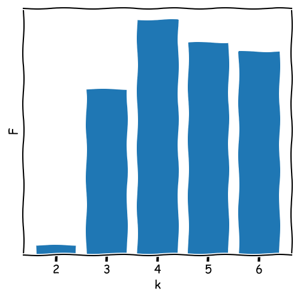
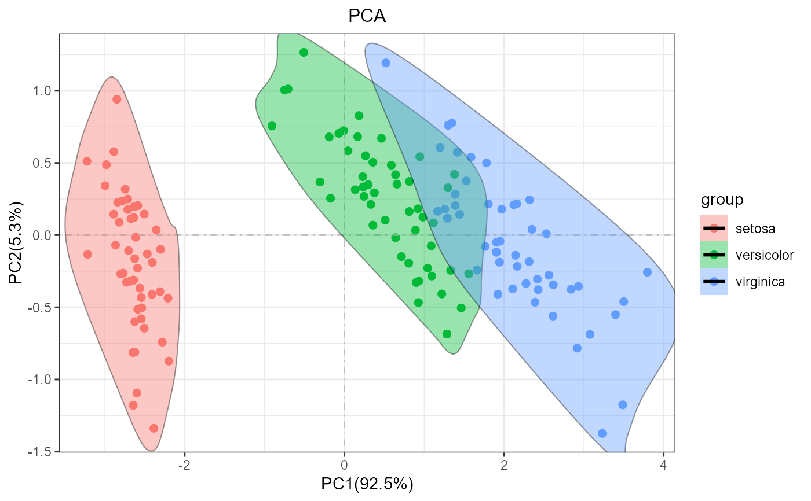
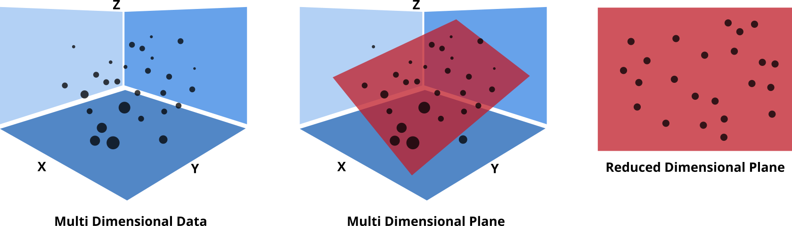

## First Slide
--- (id="first-slide")

## Initial thoughts on data analysis

  

    

      Let's assume we have a data set that contains the following information:
    

    

      Each sample was measured with 10 replicates and the mean values are given in the table below.
    

    <table style="font-size: medium;">
      <thead>
        <tr>
          <th>Sample</th><th>[Fe]</th>
        </tr>
      </thead>
      <tbody>
        <tr><td>1</td><td>2.3</td></tr>
        <tr><td>2</td><td>2.7</td></tr>
        <tr><td>3</td><td>1.9</td></tr>
        <tr><td>4</td><td>2.1</td></tr>
        <tr><td>5</td><td>2.5</td></tr>
      </tbody>
    </table>
  

  

  

      

    

      We can easily compare these samples, e.g., using <code>ANOVA</code> or <code>t-test</code>.
    

  

--- (id="initial-thoughts")

## Initial thoughts on data analysis

  

    

      Now, let's assume we have a data set that contains the following information:
    

    

      Each sample was measured with 10 replicates and the mean values are given in the table below.
    

    <table style="font-size: medium;">
      <thead>
        <tr>
          <th>Sample</th><th>[Fe]</th><th>[Cu]</th><th>[Zn]</th><th>[Mn]</th>
        </tr>
      </thead>
      <tbody>
        <tr><td>1</td><td>2.3</td><td>1.2</td><td>0.5</td><td>0.2</td></tr>
        <tr><td>2</td><td>2.7</td><td>1.1</td><td>0.4</td><td>0.3</td></tr>
        <tr><td>3</td><td>1.9</td><td>1.3</td><td>0.6</td><td>0.1</td></tr>
        <tr><td>4</td><td>2.1</td><td>1.0</td><td>0.3</td><td>0.4</td></tr>
        <tr><td>5</td><td>2.5</td><td>1.4</td><td>0.7</td><td>0.5</td></tr>
      </tbody>
    </table>
  

  

  

      

    

      How can we compare these samples?
    

  

--- (id="initial-thoughts-2")

## Similarity Measures - Metrics

  

    

      There are several metrics available to calculate the similarity between samples with multiple variables
      (multivariate data).
    

    

      

        <code>Minkowski distance</code> is a generalization of distances and is defined as:
        $$ d = \left( \sum_{i=1}^{n} |x_i - y_i|^p \right)^{1/p} $$
        Where $x_i$ and $y_i$ are the values of the $i$ -th variable of the samples $x$ and $y$, 
        respectively.
      

    

    

      

        <code>Manhattan distance</code> (L1 norm) is defined as:
        $$ d = \sum_{i=1}^{n} |x_i - y_i| $$
        Where $x_i$ and $y_i$ are the values of the $i$ -th variable of the samples $x$ and $y$, 
        respectively.
      

    

    

      

        <code>Euclidean distance</code> (L2 norm) is defined as:
        $$ d = \sqrt{\sum_{i=1}^{n} (x_i - y_i)^2} $$
        Where $x_i$ and $y_i$ are the values of the $i$ -th variable of the samples $x$ and $y$, 
        respectively.
      

    

  

  

  

      

        
off

        
Manhattan

        
Euclidean

      

      

        

      

      

        

      

      

        

      

  

--- (id="similarity-measures-metrics")

## Minkowski Distance

  

    

      The Minkowski distance is a generalized difference-based metric:
      $$
      d = \left( \sum_{i=1}^{n} |x_i - y_i|^p \right)^{1/p}
      $$
      where $ p $ is the order of the distance.
    

  

  

  

    

      Example: given the following data points:
    <pre><code data-trim data-noescape>A = [5.2, 3.9, 2.1, 1.8, 0.7]
B = [4.8, 3.7, 2.0, 1.7, 0.6]</code></pre>
    <pre>
        <code data-trim data-noescape>d = |5.2 - 4.8|^1 + |3.9 - 3.7|^1 
  + |2.1 - 2.0|^1 + |1.8 - 1.7|^1 
  + |0.7 - 0.6|^1</code></pre>
<pre>
        <code data-trim data-noescape>d = 0.40 + 0.20 + 0.10 + 0.10 + 0.10
d = 0.90</code></pre>
    

  

--- (id="minkowski-distance")

## Correlation-based Similarity Measures

  

    
Correlation coefficients quantify the similarity between variables by measuring
      linear relationships.

    

      <code>Pearson Correlation:</code> Measures linear relationships between two variables, ranging from -1 to
      +1.
      $$
      r = \frac{\sum (x_i - \bar{x})(y_i - \bar{y})}{\sqrt{\sum (x_i - \bar{x})^2 \sum (y_i - \bar{y})^2}}
      $$
      where $\bar{x}$ and $\bar{y}$ are the means of the variables.
    

    

      $$d = 1 - r$$
      where $r$ is the Pearson correlation coefficient and $d$ is the distance.
    

  

  

  

    

      Example: given the following data points:
    <pre><code data-trim data-noescape>A = [5.2, 3.9, 2.1, 1.8, 0.7]
B = [4.8, 3.7, 1.8, 1.9, 0.6]</code></pre>
    <pre>
        <code data-trim data-noescape>A_mean = 2.94
B_mean = 2.56
Cov(A, B) = 1 / (N-1) * 
  [  
      (5.2 - 2.94) * (4.8 - 2.56) 
    + (3.9 - 2.94) * (3.7 - 2.56) 
    + (2.1 - 2.94) * (1.8 - 2.56) 
    + (1.8 - 2.94) * (1.9 - 2.56) 
    + (0.7 - 2.94) * (0.6 - 2.56)
  ]
Cov(A, B) / (std(A) * std(B)) = 0.99
>> d = 1 - 0.99 = 0.01</code></pre>
    

  

--- (id="correlation-based-similarity-measures")

## Correlation-based Similarity Measures

  

    
Correlation coefficients quantify the similarity between variables by measuring
      linear relationships.

    

      <code>Spearman Correlation:</code> Ranks* data to assess monotonic relationships, useful for non-linear
      data.
      $$
      r_s = 1 - \frac{6 \sum d_i^2}{n(n^2 - 1)}
      $$
      where $d_i$ is the difference between ranks*.
    

    

      $$d = 1 - r_s$$
      where $r_s$ is the Spearman correlation coefficient and $d$ is the distance.
  

  

  

    

      Example: given the following data points:
    <pre><code data-trim data-noescape>A = [5.2, 3.9, 2.1, 1.8, 0.7]
B = [4.8, 3.7, 1.8, 1.9, 0.6]</code></pre>
    <pre>
        <code data-trim data-noescape>A_rank = [5, 4, 3, 2, 1]
B_rank = [5, 4, 1, 2, 3]
d = [0, 0, 2, 0, 2]
r_s = 1 - 6 * 
  (0^2 + 0^2 + 2^2 + 0^2 + 2^2) / 
  (5 * (5^2 - 1))
r_s = 0.6
>> d = 1 - 0.6 = 0.4</code>
      </pre>
    

  

  
*Ranks are the position of the data in a sorted list.

--- (id="correlation-based-similarity-measures-2")

## Cosine Similarity as a Similarity Measure

  

    
Cosine similarity measures the similarity between two vectors by comparing their
      direction, normalized by their magnitudes.

    

      <code>Cosine Similarity:</code> Defined as the dot product of two vectors divided by the product of their
      norms.
      $$
      \text{similarity} = \frac{\sum_{i=1}^{n} x_i \cdot y_i}{||X|| \cdot ||Y||}
      $$
      where $ ||X|| = \sqrt{\sum_{i=1}^{n} x_i^2} $ and $ ||Y|| = \sqrt{\sum_{i=1}^{n} y_i^2} $.
    

  

  

  

    

      Example: given the following vectors:
    <pre><code data-trim data-noescape>X = [2, 3, 4]
Y = [1, 0, 5]</code></pre>
    <pre id="distanceCalculation">
        <code data-trim data-noescape>dot_product = 2*1 + 3*0 + 4*5 = 22
||X|| = sqrt(2^2 + 3^2 + 4^2) = 5.39
||Y|| = sqrt(1^2 + 0^2 + 5^2) = 5.10
similarity = 22 / (5.39 * 5.10)
similarity ≈ 0.80</code></pre>
    

  

  
The cosine similarity ranges from -1 to 1, with higher values
    indicating greater similarity in direction.

--- (id="cosine-similarity-as-a-similarity-measure")

## Overview: Choosing the Right Similarity Measure

  

    
<code>Minkowski Distance</code>

    
General distance metric for multivariate data.

    
Adjustable: Manhattan (p=1), Euclidean (p=2).

    
Works best with continuous numeric data.

    
<code>Pearson Correlation</code>

    
Measures linear relationships.

    
Good for continuous, normally distributed data.

    
Sensitive to outliers.

  

  

  

    
<code>Spearman Correlation</code>

    
For monotonic (ranked) relationships.

    
Works with ordinal or non-linear data.

    
Less sensitive to outliers than Pearson.

    
<code>Cosine Similarity</code>

    
Measures similarity in vector direction.

    
Useful in high-dimensional data (e.g., text).

    
Focuses on orientation, not magnitude.

    

      There is no one-size-fits-all similarity measure. Choose the one that best fits your data and research
      question.
    

  

--- (id="overview-choosing-the-right-similarity-measure")

## Hierarchical Cluster Analysis (HCA)

  

    
HCA groups similar items into clusters based on their similarity or distance.

    
The result is a dendrogram, a tree-like structure showing the nested clusters.

    
Types of HCA:

    
<strong>Agglomerative (bottom-up):</strong> Starts with individual items and merges
      them into clusters.

    
<strong>Divisive (top-down):</strong> Starts with one cluster of all items and
      splits them into smaller clusters.

  

  

  

    

      
Data

      
Dendrogram

    

    

      

        <pre style="font-size: large;">
          <code data-trim data-noescape>┌────────┬───────┬───────┬───────┬───────┬───────┐
│ Sample │ [Fe]  │ [Cu]  │ [Zn]  │ [Mn]  │ [Pb]  │
├────────┼───────┼───────┼───────┼───────┼───────┤
│    1   │  2.3  │  1.2  │  0.5  │  0.2  │  0.1  │
│    2   │  2.7  │  1.1  │  0.4  │  0.3  │  0.2  │
│    3   │  1.9  │  1.3  │  0.6  │  0.1  │  0.2  │
│    4   │  2.1  │  1.0  │  0.3  │  0.4  │  0.7  │
│    5   │  2.5  │  1.4  │  0.7  │  0.5  │  0.6  │
│    6   │  2.2  │  1.5  │  0.8  │  0.6  │  0.5  │
│    7   │  2.4  │  1.6  │  0.9  │  0.7  │  0.1  │
│    8   │  2.6  │  1.7  │  1.0  │  0.8  │  0.3  │
└────────┴───────┴───────┴───────┴───────┴───────┘</code></pre>
      

    

    

      

    

  

--- (id="hierarchical-cluster-analysis-hca")

## Step 1: Calculating Pairwise Distances

  

    
HCA starts by calculating distances or similarities between all pairs of items.

    
The result is a distance matrix, showing how similar or different each pair of items
      is.

    
Common distance measures include:

    
<strong>Euclidean distance</strong>: Measures straight-line distance.

    
<strong>Manhattan distance</strong>: Measures distance by summing absolute
      differences.

  

  

  

    <!-- Distance Matrix -->
    <pre style="font-size: large">
      <code data-trim data-noescape style="overflow: hidden;">┌────┬─────┬─────┬─────┬─────┬─────┬─────┬─────┬─────┐
│Smpl│ #1  │ #2  │ #3  │ #4  │ #5  │ #6  │ #7  │ #8  │
├────┼─────┼─────┼─────┼─────┼─────┼─────┼─────┼─────┤
│ #1 │ .   │ .45 │ .45 │ .72 │ .68 │ .71 │ .76 │ .99 │
│ #2 │ .45 │ .   │ .87 │ .80 │ .65 │ .87 │ .87 │ .99 │
│ #3 │ .45 │ .87 │ .   │ .75 │ .84 │ .71 │ .89 │ 1.1 │
│ #4 │ .72 │ .80 │ .75 │ .   │ .71 │ .77 │ 1.1 │ 1.2 │
│ #5 │ .68 │ .65 │ .84 │ .71 │ .   │ .36 │ .62 │ .61 │
│ #6 │ .71 │ .87 │ .71 │ .77 │ .36 │ .   │ .48 │ .57 │
│ #7 │ .76 │ .87 │ .89 │ 1.1 │ .62 │ .48 │ .   │ .33 │
│ #8 │ .99 │ .99 │ 1.1 │ 1.2 │ .61 │ .57 │ .33 │ .   │
└────┴─────┴─────┴─────┴─────┴─────┴─────┴─────┴─────┘</code></pre>
  

--- (id="step-1-calculating-pairwise-distances")

## Step 2: Merging the Closest Items

  

    
The two items with the smallest distance are merged to form a cluster.

    
This cluster is represented as a node in the dendrogram, showing the first grouping
      of similar items.

    
Each node’s height represents the distance at which items or clusters are joined.
    

  

  

  

    

      
Data

      
Dendrogram

    

    

      <pre style="font-size: large;">
┌────┬─────┬─────┬─────┬─────┬─────┬─────┬─────┬─────┐
│Smpl│ #1  │ #2  │ #3  │ #4  │ #5  │ #6  │ #7  │ #8  │
├────┼─────┼─────┼─────┼─────┼─────┼─────┼─────┼─────┤
│ #1 │ .   │ .45 │ .45 │ .72 │ .68 │ .71 │ .76 │ .99 │
│ #2 │ .45 │ .   │ .87 │ .80 │ .65 │ .87 │ .87 │ .99 │
│ #3 │ .45 │ .87 │ .   │ .75 │ .84 │ .71 │ .89 │ 1.1 │
│ #4 │ .72 │ .80 │ .75 │ .   │ .71 │ .77 │ 1.1 │ 1.2 │
│ #5 │ .68 │ .65 │ .84 │ .71 │ .   │ .36 │ .62 │ .61 │
│ #6 │ .71 │ .87 │ .71 │ .77 │ .36 │ .   │ .48 │ .57 │
│ #7 │ .76 │ .87 │ .89 │ 1.1 │ .62 │ .48 │ .   │ .33 │
│ #8 │ .99 │ .99 │ 1.1 │ 1.2 │ .61 │ .57 │ .33 │ .   │
└────┴─────┴─────┴─────┴─────┴─────┴─────┴─────┴─────┘
      </pre>
    

    

      

    

  

--- (id="step-2-merging-the-closest-items")

## Step 3: Recomputing Distances and Continuing Merging

  

    
After each merge, recalculate distances between the new cluster and other items or
      clusters.

    
Different linkage methods can be used to update distances:

    
<strong>Single linkage:</strong> Uses the smallest distance between items in two
      clusters.

    
<strong>Complete linkage:</strong> Uses the largest distance between items in two
      clusters.

    
<strong>Average linkage:</strong> Uses the average distance between all items in
      two clusters.

  

  

  

    <pre style="font-size: large; margin-top: -20px;">
┌────┬─────┬─────┬─────┬─────┬─────┬─────┬─────┬─────┐
│Smpl│ #1  │ #2  │ #3  │ #4  │ #5  │ #6  │ #7  │ #8  │
├────┼─────┼─────┼─────┼─────┼─────┼─────┼─────┼─────┤
│ #1 │ .   │ .45 │ .45 │ .72 │ .68 │ .71 │ .76 │ .99 │
│ #2 │ .45 │ .   │ .87 │ .80 │ .65 │ .87 │ .87 │ .99 │
│ #3 │ .45 │ .87 │ .   │ .75 │ .84 │ .71 │ .89 │ 1.1 │
│ #4 │ .72 │ .80 │ .75 │ .   │ .71 │ .77 │ 1.1 │ 1.2 │
│ #5 │ .68 │ .65 │ .84 │ .71 │ .   │ .36 │ .62 │ .61 │
│ #6 │ .71 │ .87 │ .71 │ .77 │ .36 │ .   │ .48 │ .57 │
│ #7 │ .76 │ .87 │ .89 │ 1.1 │ .62 │ .48 │ .   │ .33 │
│ #8 │ .99 │ .99 │ 1.1 │ 1.2 │ .61 │ .57 │ .33 │ .   │
└────┴─────┴─────┴─────┴─────┴─────┴─────┴─────┴─────┘
      </pre>
    <pre style="font-size: large; margin-top: -20px;">
average linkage:
┌────┬─────┬─────┬─────┬─────┬─────┬─────┬─────┐
│Smpl│ #1  │ #2  │ #3  │ #4  │ #5  │ #6  │ #78 │
├────┼─────┼─────┼─────┼─────┼─────┼─────┼─────┤
│ #1 │ .   │ .45 │ .45 │ .72 │ .68 │ .71 │ .88 │
│ #2 │ .45 │ .   │ .87 │ .80 │ .65 │ .87 │ .93 │
│ #3 │ .45 │ .87 │ .   │ .75 │ .84 │ .71 │ 1.0 │
│ #4 │ .72 │ .80 │ .75 │ .   │ .71 │ .77 │ 1.2 │
│ #5 │ .68 │ .65 │ .84 │ .71 │ .   │ .36 │ .62 │
│ #6 │ .71 │ .87 │ .71 │ .77 │ .36 │ .   │ .53 │
│#78 │ .88 │ .93 │ 1.0 │ 1.2 │ .62 │ .53 │ .   │
└────┴─────┴─────┴─────┴─────┴─────┴─────┴─────┘
</pre>
  

--- (id="step-3-recomputing-distances-and-continuing-merging")

## Step 4: Building the Dendrogram

  

    
The process continues until all items are merged into a single cluster.

    
The dendrogram visually represents this nested grouping structure.

    
The height of each node indicates the distance at which clusters are merged.

  

  

  

    

      
1

      
2

      
3

      
4

      
5

      
6

    

    <!-- Placeholder for full dendrogram -->
    

      <pre style="font-size: large; margin-top: -20px;">
┌────┬─────┬─────┬─────┬─────┬─────┬─────┬─────┬─────┐
│Smpl│ #1  │ #2  │ #3  │ #4  │ #5  │ #6  │ #7  │ #8  │
├────┼─────┼─────┼─────┼─────┼─────┼─────┼─────┼─────┤
│ #1 │ .   │ .45 │ .45 │ .72 │ .68 │ .71 │ .76 │ .99 │
│ #2 │ .45 │ .   │ .87 │ .80 │ .65 │ .87 │ .87 │ .99 │
│ #3 │ .45 │ .87 │ .   │ .75 │ .84 │ .71 │ .89 │ 1.1 │
│ #4 │ .72 │ .80 │ .75 │ .   │ .71 │ .77 │ 1.1 │ 1.2 │
│ #5 │ .68 │ .65 │ .84 │ .71 │ .   │ .36 │ .62 │ .61 │
│ #6 │ .71 │ .87 │ .71 │ .77 │ .36 │ .   │ .48 │ .57 │
│ #7 │ .76 │ .87 │ .89 │ 1.1 │ .62 │ .48 │ .   │ .33 │
│ #8 │ .99 │ .99 │ 1.1 │ 1.2 │ .61 │ .57 │ .33 │ .   │
└────┴─────┴─────┴─────┴─────┴─────┴─────┴─────┴─────┘
</pre>
      <pre style="font-size: large; margin-top: -20px;">
average linkage:
┌────┬─────┬─────┬─────┬─────┬─────┬─────┬─────┐
│Smpl│ #1  │ #2  │ #3  │ #4  │ #5  │ #6  │ #78 │
├────┼─────┼─────┼─────┼─────┼─────┼─────┼─────┤
│ #1 │ .   │ .45 │ .45 │ .72 │ .68 │ .71 │ .88 │
│ #2 │ .45 │ .   │ .87 │ .80 │ .65 │ .87 │ .93 │
│ #3 │ .45 │ .87 │ .   │ .75 │ .84 │ .71 │ 1.0 │
│ #4 │ .72 │ .80 │ .75 │ .   │ .71 │ .77 │ 1.2 │
│ #5 │ .68 │ .65 │ .84 │ .71 │ .   │ .36 │ .62 │
│ #6 │ .71 │ .87 │ .71 │ .77 │ .36 │ .   │ .53 │
│#78 │ .88 │ .93 │ 1.0 │ 1.2 │ .62 │ .53 │ .   │
└────┴─────┴─────┴─────┴─────┴─────┴─────┴─────┘
</pre>
    

    

      <pre style="font-size: large; margin-top: -20px;">
┌────┬─────┬─────┬─────┬─────┬─────┬─────┬─────┐
│Smpl│ #1  │ #2  │ #3  │ #4  │ #5  │ #6  │ #78 │
├────┼─────┼─────┼─────┼─────┼─────┼─────┼─────┤
│ #1 │ .   │ .45 │ .45 │ .72 │ .68 │ .71 │ .88 │
│ #2 │ .45 │ .   │ .87 │ .80 │ .65 │ .87 │ .93 │
│ #3 │ .45 │ .87 │ .   │ .75 │ .84 │ .71 │ 1.0 │
│ #4 │ .72 │ .80 │ .75 │ .   │ .71 │ .77 │ 1.2 │
│ #5 │ .68 │ .65 │ .84 │ .71 │ .   │ .36 │ .62 │
│ #6 │ .71 │ .87 │ .71 │ .77 │ .36 │ .   │ .53 │
│#78 │ .88 │ .93 │ 1.0 │ 1.2 │ .62 │ .53 │ .   │
└────┴─────┴─────┴─────┴─────┴─────┴─────┴─────┘
</pre>
      <pre style="font-size: large; margin-top: -20px;">
average linkage:
┌────┬─────┬─────┬─────┬─────┬─────┬─────┐
│Smpl│ #1  │ #2  │ #3  │ #4  │ #56 │ #78 │
├────┼─────┼─────┼─────┼─────┼─────┼─────┤
│ #1 │ .   │ .45 │ .45 │ .72 │ .70 │ .88 │
│ #2 │ .45 │ .   │ .87 │ .80 │ .76 │ .93 │
│ #3 │ .45 │ .87 │ .   │ .75 │ .78 │ 1.0 │
│ #4 │ .72 │ .80 │ .75 │ .   │ .74 │ 1.2 │
│#56 │ .70 │ .76 │ .78 │ .74 │ .   │ .58 │
│#78 │ .88 │ .93 │ 1.0 │ 1.2 │ .58 │ .   │
└────┴─────┴─────┴─────┴─────┴─────┴─────┘
</pre>
    

    

      <pre style="font-size: large; margin-top: -20px;">
┌─────┬─────┬─────┬─────┬─────┬─────┬─────┐
│Smpl │ #1  │ #2  │ #3  │ #4  │ #56 │ #78 │
├─────┼─────┼─────┼─────┼─────┼─────┼─────┤
│ #1  │ .   │ .45 │ .45 │ .72 │ .70 │ .88 │
│ #2  │ .45 │ .   │ .87 │ .80 │ .76 │ .93 │
│ #3  │ .45 │ .87 │ .   │ .75 │ .78 │ 1.0 │
│ #4  │ .72 │ .80 │ .75 │ .   │ .74 │ 1.2 │
│ #56 │ .70 │ .76 │ .78 │ .74 │ .   │ .58 │
│ #78 │ .88 │ .93 │ 1.0 │ 1.2 │ .58 │ .   │
└─────┴─────┴─────┴─────┴─────┴─────┴─────┘
</pre>
      <pre style="font-size: large; margin-top: -20px;">
average linkage:
┌─────┬─────┬─────┬─────┬─────┬─────┐
│Smpl │ #12 │ #3  │ #4  │ #56 │ #78 │
├─────┼─────┼─────┼─────┼─────┼─────┤
│ #12 │ .   │ .66 │ .76 │ .73 │ .91 │
│ #3  │ .66 │ .   │ .75 │ .78 │ 1.0 │
│ #4  │ .76 │ .75 │ .   │ .74 │ 1.2 │
│ #56 │ .73 │ .78 │ .74 │ .   │ .58 │
│ #78 │ .91 │ 1.0 │ 1.2 │ .58 │ .   │
└─────┴─────┴─────┴─────┴─────┴─────┘
</pre>
    

    

      <pre style="font-size: large; margin-top: -20px;">
┌─────┬─────┬─────┬─────┬─────┬─────┐
│Smpl │ #12 │ #3  │ #4  │ #56 │ #78 │
├─────┼─────┼─────┼─────┼─────┼─────┤
│ #12 │ .   │ .66 │ .76 │ .73 │ .91 │
│ #3  │ .66 │ .   │ .75 │ .78 │ 1.0 │
│ #4  │ .76 │ .75 │ .   │ .74 │ 1.2 │
│ #56 │ .73 │ .78 │ .74 │ .   │ .58 │
│ #78 │ .91 │ 1.0 │ 1.2 │ .58 │ .   │
└─────┴─────┴─────┴─────┴─────┴─────┘
</pre>
      <pre style="font-size: large; margin-top: -20px;">
average linkage:
┌───────┬─────┬─────┬─────┬───────┐
│ Smpl  │ #12 │ #3  │ #4  │ #5678 │
├───────┼─────┼─────┼─────┼───────┤
│ #12   │ .   │ .66 │ .76 │ .82   │
│ #3    │ .66 │ .   │ .75 │ .89   │
│ #4    │ .76 │ .75 │ .   │ .97   │
│ #5678 │ .82 │ .89 │ .97 │ .     │
└───────┴─────┴─────┴─────┴───────┘
</pre>
    

    

      <pre style="font-size: large; margin-top: -20px;">
┌───────┬─────┬─────┬─────┬───────┐
│ Smpl  │ #12 │ #3  │ #4  │ #5678 │
├───────┼─────┼─────┼─────┼───────┤
│ #12   │ .   │ .66 │ .76 │ .82   │
│ #3    │ .66 │ .   │ .75 │ .89   │
│ #4    │ .76 │ .75 │ .   │ .97   │
│ #5678 │ .82 │ .89 │ .97 │ .     │
└───────┴─────┴─────┴─────┴───────┘
</pre>
      <pre style="font-size: large; margin-top: -20px;">
average linkage:
┌───────┬─────┬─────┬──────┐
│ Smpl  │ #123│ #4  │ #5678│
├───────┼─────┼─────┼──────┤
│ #123  │ .   │ .76 │ .86  │
│ #4    │ .76 │ .   │ .97  │
│ #5678 │ .86 │ .97 │ .    │
└───────┴─────┴─────┴──────┘
</pre>
    

    

      <pre style="font-size: large; margin-top: -20px;">
┌───────┬─────┬─────┬──────┐
│ Smpl  │ #123│ #4  │ #5678│
├───────┼─────┼─────┼──────┤
│ #123  │ .   │ .76 │ .86  │
│ #4    │ .76 │ .   │ .97  │
│ #5678 │ .86 │ .97 │ .    │
└───────┴─────┴─────┴──────┘
</pre>
      <pre style="font-size: large; margin-top: -20px;">
average linkage:
┌───────┬───────┬───────┐
│ Smpl  │ #1234 │ #5678 │
├───────┼───────┼───────┤
│ #1234 │ .     │ .92   │
│ #5678 │ .92   │ .     │
└───────┴───────┴───────┘
</pre>
    

  

--- (id="step-3-recomputing-distances-and-continuing-merging")

## Step 4: Building the Dendrogram

  

    
The process continues until all items are merged into a single cluster.

    
The dendrogram visually represents this nested grouping structure.

    
The height of each node indicates the distance at which clusters are merged.

  

  

  

    

      
1

      
2

      
3

      
4

      
5

    

    

      

    

    

      

    

    

      

    

    

      

    

    

      

    

  

--- (id="step-4-building-the-dendrogram")

## Reading a Dendrogram

  

    
A dendrogram helps identify clusters and understand the relationship between items:
    

    
Each leaf represents an individual item in the dataset.

    
Clusters are formed by cutting the dendrogram at a certain height.

    
The height of each node indicates the distance or similarity level at which
      clusters are joined.

    
To identify clusters, look for branches that join at lower heights for more similar
      items.

  

  

  

    

  

--- (id="reading-a-dendrogram")

## Advantages and Limitations of HCA

  

    
<code>Advantages</code>

    

      Does not require a predefined number of clusters; HCA provides a complete hierarchy.
    

    

      Generates a <code>dendrogram</code> that visually represents cluster relationships at multiple levels.
    

    

      Effective for small to medium datasets, especially when clusters are well-separated.
    

    

      Ideal for discovering nested or hierarchical data structures, useful in fields like taxonomy and genomics.
    

  

  

  

    
<code>Limitations</code>

    

      Computationally demanding, especially for large datasets (complexity of $O(n^2)$).
    

    

      Sensitive to noise and outliers; even small variations can affect cluster results.
    

    

      Does not allow reassignment of points after merging, which can lead to misclassification.
    

    

      Challenging with high-dimensional data, as distance-based calculations may become less reliable.
    

  

--- (id="advantages-and-limitations-of-hca")

## Introduction to k-means Clustering

  

    
k-means is a popular clustering algorithm for partitioning data into $ k $
      clusters.

    
The algorithm aims to minimize within-cluster variance, making clusters as compact
      as possible.

    
Each cluster is defined by its centroid, which is the mean of all points within that
      cluster.

  

  

  

    <!-- Placeholder for initial dataset plot with no clusters -->
    

  

--- (id="introduction-to-k-means-clustering")

## Step 1: Choosing the Number of Clusters (k)

  

    

      The number of clusters $ k $ must be chosen before running k-means.
    

    

      Selecting $ k $ can be challenging, as it affects the algorithm’s results
      significantly.
    

    

      A common approach is to start with <code>k=2</code> and increase until the clustering quality stabilizes.
    

  

  

  

    <!-- Placeholder for elbow method plot or silhouette score example -->
    

  

--- (id="step-1-choosing-the-number-of-clusters-k")

## Step 2: Initializing Cluster Centroids

  

    
k-means starts by randomly selecting $ k $ initial centroids in the data space.
    

    
These centroids act as the starting points for forming clusters.

    
The choice of initial centroids can affect the final clustering results, so multiple
      initializations may be tested.

  

  

  

    <!-- Placeholder for plot showing initial centroids on data -->
    

  

--- (id="step-2-initializing-cluster-centroids")

## Step 3: Assigning Points to Nearest Centroids

  

    
Each data point is assigned to the nearest centroid, forming initial clusters.

    
This assignment is based on minimizing the distance between points and centroids
      (usually Euclidean distance).

    
Points closest to a centroid belong to that centroid’s cluster.

  

  

  

    <!-- Placeholder for plot showing points assigned to initial centroids -->
    

  

--- (id="step-3-assigning-points-to-nearest-centroids")

## Step 4: Updating Centroids

  

    
Once points are assigned, the centroids are recalculated as the mean of all points
      in each cluster.

    
This step shifts each centroid to a new position, centered within its assigned
      points.

    
After updating, points are reassigned to the nearest centroid, and the process
      repeats.

  

  

  

    

      
current assignment

      
updated assignment

    

    <!-- Placeholder for plot showing updated centroids -->
    

      

    

    

      

    

  

--- (id="step-4-updating-centroids")

## Step 5: Iterating Until Convergence

  

    
k-means alternates between assigning points and updating centroids until
      convergence.

    
Convergence is reached when centroid positions stop changing significantly.

    
The final clusters minimize within-cluster variance.

  

  

  

    <label for="kSlider" style="font-size: large;">no. clusters $ k $: 1</label>
    <input type="range" id="kSlider" min="1" max="6" step="1" value="1">
    <!-- Placeholder for plot showing final clusters -->
    

  

--- (id="step-5-iterating-until-convergence")

## Evaluating the Clustering Results

  

    
To assess clustering quality, metrics such as the following are commonly used:

    
<strong>Inertia (within-cluster variance):</strong> Measures compactness within
      clusters; lower is better.

    
<strong>Silhouette Score:</strong> Measures cohesion and separation; ranges from -1
      to 1.

    
<strong>ANOVA:</strong> Evaluates the separation between clusters by comparing
      between-cluster and within-cluster variance.

    
  

  

  

    

      
inertia

      
silhouette score

      
ANOVA

    

    

      

      $$
        \text{Inertia} = \sum_{i=1}^{k} \sum_{x \in C_i} \| x - \mu_i \|^2
        $$

      
where $ x $ represents a data point in cluster $ C_i $,  and $ \mu_i $ is
        the centroid of cluster $ C_i $.

    

    

      

      $$
        \text{Silhouette Score} = \frac{b - a}{\max(a, b)}
        $$

      
where $ a $ is the mean intra-cluster distance for each sample, and $ b $ is
        the mean nearest-cluster distance for each sample.

    

    

      

      $$
        F = \frac{\text{Between-Cluster Variance}}{\text{Within-Cluster Variance}}
        $$

      
Used in ANOVA to assess the ratio of variance between clusters to the variance
        within clusters.

    

  

--- (id="evaluating-the-clustering-results")

## Advantages and Limitations of K-Means

  

    
<code>Advantages</code>

    

      Simple and efficient for large datasets with low computational complexity, especially when clusters are
      well-separated.
    

    

      Can be easily adapted for different use cases, such as image compression and document clustering.
    

    

      Works well with spherical-shaped clusters where data points are evenly distributed around a centroid.
    

  

  

  

    
<code>Limitations</code>

    

      Requires the number of clusters, <code>k</code>, to be specified in advance, which can be challenging to
      determine.
    

    

      Sensitive to initial centroid placement, potentially leading to different clustering results in each run.
    

    

      Not suitable for non-spherical clusters or clusters with varying sizes and densities.
    

    

      Struggles with outliers, which can significantly impact the cluster centroids and overall result.
    

  

--- (id="advantages-and-limitations-of-k-means")

## What is Principal Component Analysis (PCA)?

  

    

      <code>Principal Component Analysis (PCA)</code> is a <code>dimensionality reduction</code> technique often
      used in data science
      and machine learning to simplify datasets by reducing the number of variables while preserving essential
      information.
    

    

      PCA works by identifying directions (<code>principal components</code>) along which the data varies the
      most.
    

    

      Applications include <code>data visualization</code>, <code>noise reduction</code>, and
      <code>feature extraction</code> for machine learning.
    

  

  

  

    
    
src: <a
        href="https://abego.cn/autopca/reference/pca.html">https://abego.cn/autopca/reference/pca.html</a>

  

--- (id="what-is-principal-component-analysis-pca")

## Dimensionality Reduction through Axis Transformation

--- (id="dimensionality-reduction-through-axis-transformation")

## Coordinate Axes as a Matrix

  

    

      The <code>coordinate axes</code> of a space can be represented as a matrix. In its simplest form, this is
      the <code>identity matrix</code>, where all axes are perpendicular.
    

    

      The <code>identity matrix</code> (or unity matrix) has values of 1 along its diagonal and 0 elsewhere,
      representing standard perpendicular axes.
    

    

      By modifying the <code>angles</code> between the axes, we can adjust this matrix to define
      <code>new coordinate systems</code>.
    

  

  

  

    <pre style="font-size: large;">
            <code data-trim data-noescape>Identity Matrix:
┌     ┐
│ 1 0 │
│ 0 1 │
└     ┘</code></pre>
    

      Example: Adjusting the identity matrix by changing angles between axes allows transformations to define
      new directions or rotations in data.
    

    <pre style="font-size: large;">
          <code data-trim data-noescape>Identity Matrix:
┌     ┐          ┌     ┐  
│ 1 0 │  Strech  │ 2 0 │  
│ 0 1 │  along   │ 0 1 │  
└     ┘  x-axis  └     ┘  
coordinates:  (5, 3)    ->  s (10, 3)</code></pre>
    

      Remember: Matrix x Vector means row-wise multiplication of the matrix with the vector. E.g.
      <code>2 * 5 + 0 * 3</code> and <code>0 * 5 + 1 * 3</code> in the example above.
    

  

--- (id="coordinate-axes-as-a-matrix")

## Dimensionality Reduction through Axis Transformation

  

    

      PCA reduces dimensions by transforming <code>coordinate axes</code>. It finds new axes,
      <code>principal components</code>, where data varies most.
    

    

      This is a mathematical <code>axis transformation</code>, projecting original data onto principal component
      axes.
    

    

      <code>Example</code>: With two features, <code>x1</code> and <code>x2</code>, PCA rotates the axes to find
      <code>PC1</code> (highest variance), possibly discarding <code>PC2</code> for dimensional reduction.
    

  

  

  

    

      
Raw Data

      
Axis Transformation

      
Bar Plots

    

    

      

    

    

      <input type="range" id="phiSlider" min="0" max="360" step="1" value="1">
      <label for="phiSlider" style="font-size: large;">angle of coordinate system: 0</label> 
      <input type="range" id="rhoSlider" min="0" max="180" step="1" value="1">
      <label for="rhoSlider" style="font-size: large;">angle between axes: 90</label>
      

    

    

      <input type="range" id="phiSlider2" min="0" max="360" step="1" value="1">
      <label for="phiSlider2" style="font-size: large;">angle of coordinate system: 0</label> 
      <input type="range" id="rhoSlider2" min="0" max="180" step="1" value="1">
      <label for="rhoSlider2" style="font-size: large;">angle between axes: 90</label>
      

      

    

  

--- (id="dimensionality-reduction-through-axis-transformation-2")

## Covariance Matrix and Data Variance

  

    

      The <code>covariance matrix</code> reveals directions in the data with maximum variation, guiding PCA to
      choose the best transformation.
    

    

      Each matrix element represents <code>covariance</code> between two features. Diagonal elements show
      variance within each feature, while off-diagonal elements show relationships between features.
    

  

  

  

    

      <code>Formula</code> for covariance between features $ x $ and $ y $:
      $$
      \text{cov}(x, y) = \frac{1}{n - 1} \sum_{i=1}^{n} (x_i - \bar{x})(y_i - \bar{y})
      $$
    

    

      Example of a 4x4 covariance matrix $ \Sigma $:
      $$
      \begin{bmatrix}
      \text{var}(x_1) & \text{cov}(x_1, x_2) & \text{cov}(x_1, x_3) & \text{cov}(x_1, x_4) \\
      \text{cov}(x_2, x_1) & \text{var}(x_2) & \text{cov}(x_2, x_3) & \text{cov}(x_2, x_4) \\
      \text{cov}(x_3, x_1) & \text{cov}(x_3, x_2) & \text{var}(x_3) & \text{cov}(x_3, x_4) \\
      \text{cov}(x_4, x_1) & \text{cov}(x_4, x_2) & \text{cov}(x_4, x_3) & \text{var}(x_4)
      \end{bmatrix}
      $$
    

  

--- (id="covariance-matrix-and-data-variance")

## Foundation of PCA Transformation: Eigenvectors and Eigenvalues

  

    

      The <code>covariance matrix</code> shows how dimensions of the data correlate and spread. Each value
      describes the joint variance between two dimensions.
    

    

      The <code>eigenvectors</code> of the covariance matrix represent directions of the greatest variance in
      the data. These define the new axes, known as <code>principal components</code>.
    

  

  

  

    

      By projecting data onto the <code>eigenvectors</code>, we highlight the
      <code>primary directions of variation</code>, reducing correlation between dimensions.
    

    

      Retaining the largest <code>eigenvalues</code> reduces dimensionality, focusing on the primary sources of
      information in the data.
    

    
  

--- (id="foundation-of-pca-transformation-eigenvectors-and-eigenvalues")

## Example: Covariance Matrix of a 4-Dimensional Dataset

  

    

      Suppose we have a dataset with four features: <code>x1</code>, <code>x2</code>, <code>x3</code>, and
      <code>x4</code>.
      The <code>covariance matrix</code> reveals relationships between these features:
    

    <pre style="font-size: large;">
      <code data-trim data-noescape>      ┌                    ┐
      │ 2.5  0.8  0.6  1.2 │
Cov = │ 0.8  1.9  0.4  0.9 │
      │ 0.6  0.4  2.3  1.1 │
      │ 1.2  0.9  1.1  3.2 │
      └                    ┘</code></pre>
    

      Diagonal elements (e.g., <code>2.5</code> for <code>x1</code>) show variance for each feature.
      Off-diagonal values indicate <code>covariance</code> between features (e.g., <code>0.8</code> between
      <code>x1</code> and <code>x2</code>).
    

  

  

  

    

      Features with high covariance are more similar. For example, <code>x3</code> and <code>x4</code> have
      covariance <code>1.1</code>, suggesting they vary similarly.
    

    

      Low covariance between features like <code>x1</code> and <code>x3</code> means PCA will place less weight
      on
      this direction, focusing on features with higher covariance to capture more variance.
    

    

      The eigenvectors of this matrix, aligned with principal components, will orient along directions with the
      highest variance, maximizing data spread along these axes.
    

  

--- (id="example-covariance-matrix-of-a-4-dimensional-dataset")

## Understanding Eigenvectors

  

    

      An <code>eigenvector</code> of a matrix is a special vector that, when multiplied by the matrix,
      changes only in scale, not direction.
    

    

      For a matrix <code>A</code> and an eigenvector <code>v</code>, we have:
      $$ A \cdot v = \lambda \cdot v $$
      where <code>λ</code> is the <code>eigenvalue</code> that scales <code>v</code>.
    

    

      In PCA, eigenvectors of the <code>covariance matrix</code> give directions for the principal components,
      with the eigenvalues showing their importance (variance captured).
    

  

  

  

    

      <code>Example:</code> For a 4D dataset, the eigenvectors might show directions of maximum spread,
      while eigenvalues indicate the strength of each direction.
    

    
Example 2: original vec & transformed vec

    

      

        <pre style="font-size: large;">
        <code data-trim data-noescape>    ┌      ┐
    │ 3  2 │
A = │ 1  5 │
    └      ┘</code></pre>
      

      

        <label for="v1" style="font-size: large;">v1:</label>
        <input type="range" id="v1" min="-6" max="6" step="0.1" value="0">
        1 
        <label for="v2" style="font-size: large;">v2:</label>
        <input type="range" id="v2" min="-6" max="6" step="0.1" value="2">
        1
      

    

    

  

--- (id="understanding-eigenvectors")

## Covariance Matrix and Its Eigenvectors & Eigenvalues

  

    
The covariance matrix of the data:

    <pre style="font-size: large;">
            <code data-trim data-noescape>      ┌                    ┐
      │ 2.5  0.8  0.6  1.2 │
Cov = │ 0.8  1.9  0.4  0.9 │
      │ 0.6  0.4  2.3  1.1 │
      │ 1.2  0.9  1.1  3.2 │
      └                    ┘</code></pre>
  

  

  

    
Eigenvector matrix and corresponding eigenvalues:

    <pre style="font-size: large;">
            <code data-trim data-noescape>    ┌                               ┐
    │  1.617  -0.777  -3.007  0.731 │
V = │ -3.288   0.115  -2.068  0.522 │
    │ -0.776  -0.819   3.786  0.601 │
    │    1       1       1      1   │
    └                               ┘
λ_1 ≈ 1.3, λ_2 ≈ 1.5, λ_3 ≈ 1.9, λ_4 ≈ 5.2</code></pre>
    

      Each <code>eigenvalue</code> λ indicates the variance captured along the direction of its
      <code>eigenvector</code>.
    

    

      The <code>eigenvectors</code> v_4 and v_3 with the highest <code>eigenvalues</code> capture the most
      variance and are the first and second principal components.
    

  

--- (id="covariance-matrix-and-its-eigenvectors-eigenvalues")

## Interpreting the Role of Eigenvectors and Eigenvalues in PCA

  

    

      <code>Eigenvectors</code> represent the <code>new axes</code> in PCA, also known as
      <code>principal components</code>.
    

    

      The individual values within an eigenvector describe how much each <code>original feature</code>
      contributes to the principal component.
    

    

      A larger value indicates that a specific feature plays a more significant role in this component.
    

  

  

  

    

      <code>Eigenvalues</code> reflect the amount of <code>variance</code> captured by each principal component.
    

    

      The sum of all eigenvalues represents the <code>total variance</code> in the data.
    

    

      Higher eigenvalues mean a component captures more variance, ideally with the first few components covering
      a substantial portion.
    

    

      If eigenvalues are distributed evenly, PCA might not significantly reduce dimensions, suggesting it may be
      less effective for the data.
    

  

--- (id="interpreting-the-role-of-eigenvectors-and-eigenvalues-in-pca")

## Transforming Data: Loadings and Scores

  

    

      To transform the data, we use the <code>eigenvectors</code> of the covariance matrix. These eigenvectors
      form a new basis for the data.
    

    

      Each data point is projected onto this new basis, creating two key components:
    

    

      <code>Scores</code>: Represent the data points in the new coordinate system defined by the principal
      components.
    

    

      <code>Loadings</code>: Show how the original variables contribute to each principal component.
    

  

  

  

    
Transformation process:

    <pre style="font-size: large;">
          <code data-trim data-noescape>Data × Eigenvectors = Scores
┌       ┐   ┌                  ┐   ┌        ┐
│ x1 x2 │ × │ v_1   v_2  ...   │ = │  PC1   │
│ ...   │   │ ...   ...  ...   │   │  PC2   │
│ xN xN │   │ v_m   v_n  ...   │   │  ...   │
└       ┘   └                  ┘   └        ┘</code></pre>
    

      Each row of <code>Scores</code> represents a transformed data point, and each column of
      <code>Loadings</code> shows the contribution of each variable to a principal component.
    

    

      PCA is data decomposition, breaking down the data into loadings $l$ & scores $s$.
      $$ Data = s \cdot l^T $$
      Where $l^T$ is the transpose of the loadings matrix (loadings are the eigenvectors).
  

--- (id="transforming-data-loadings-and-scores")

## Working Example: PCA on Fruits Dataset

  

    

      Different Fruits as Samples.
    

    

      Apple, Banana, Lime, Grape, Pineapple
    

    

      Different measurements methods as Features.
    

    

      Sweetness, Weight, Price
    

    

      Sourness, Color(Red), Color(Blue), Color(Green)
    

  

  

  

    <pre style="font-size: medium;">
Sweetness Weight Price Sourness Color(R) Color(G) Color(B)
9.0     995.6  5.0    1.0      246      255      38
7.3     156.1  2.9    3.9      249       16      12
5.3     143.6  2.1    3.4      250        9      28
5.8     122.5  0.6    2.3      248      250       7
6.9      99.8  1.3    1.9      251      255       9
3.0      39.3  2.2    8.5        5      253       4
5.4     158.4  3.2    3.3      255        7      11
4.3     126.2  1.4    3.0      255      255       3
3.4      58.6  1.7    7.0       15      254      15
6.6     124.6  1.3    1.1      255      243      11
7.8       7.7  4.6    3.8      115       12      99
9.8     995.7  5.6    3.1      255      255      37
8.5      18.1  4.5    2.2      137        9     127
2.2      55.2  3.0    7.7        7      255       1
7.8      13.3  4.7    2.7      140       13     123
3.7      41.3  2.8    8.8        9      239       1
2.2      44.4  1.9    8.0        8      255      18
8.0    1000.8  5.0    1.5      255      255      48
6.2     151.1  3.7    4.8      255       12       2
7.3     129.2  1.2    0.0      248      233       5
8.7     141.5  2.9    3.6      253        9       3
7.2     122.8  1.4    2.9      255      249       7
8.8    1005.9  6.4    0.4      253      255      58
4.0      38.3  2.9    7.7       11      255       7
7.7    1009.1  4.9    1.6      255      255      36
8.1     984.8  5.3    1.1      253      255      33
7.7      13.1  3.8    2.8      124        8     115
</pre>
  

--- (id="working-example-pca-on-fruits-dataset")

## Working Example: PCA on Fruits Dataset 
    < Scores Plot>
  

--- (id="working-example-pca-on-fruits-dataset-scores-plot")

## Working Example: PCA on Fruits Dataset 
    < Bi-Plot>
  

--- (id="working-example-pca-on-fruits-dataset-bi-plot")

## Working Example: PCA on Fruits Dataset 
    < Interpretation>
  

  

    

      The PCA bi-plot shows the relationship between samples and features in the transformed space.
    

    

      Samples are represented by points, while features are shown as vectors.
    

    

      The length and direction of feature vectors indicate their importance and relationship to samples.
    

  

  

  

    
    

      In this example, the first principal component (PC1) is strongly influenced weight, while the second
      principal component (PC2) is driven by color features.
    

  

--- (id="working-example-pca-on-fruits-dataset-interpretation")

## Advantages and Limitations of PCA

  

    
Advantages of PCA

    

      <code>Dimensionality Reduction</code>: Simplifies datasets by reducing variables, preserving core
      information.
    

    

      <code>Noise Reduction</code>: Filters noise by focusing on components with the highest variance.
    

    

      <code>Improved Visualization</code>: Enables visualization of high-dimensional data in 2D or 3D.
    

    

      <code>Feature Extraction</code>: Highlights uncorrelated variables, making dominant features clear.
    

  

  

  

    
Limitations of PCA

    

      <code>Linear Assumptions</code>: Captures linear relationships but may miss non-linear structures.
    

    

      <code>Loss of Interpretability</code>: Principal components lack intuitive meaning compared to original
      features.
    

    

      <code>Variance-Based Selection</code>: Ignores low-variance components that may still hold relevant
      information.
    

    

      <code>Scaling Sensitivity</code>: Results can vary with inconsistent feature scaling.
    

  

--- (id="advantages-and-limitations-of-pca")

## Excursion to Linear Discriminant Analysis (LDA)

  

    

      <code>Linear Discriminant Analysis (LDA)</code> is similar to PCA, but with a focus on distinguishing
      between predefined groups.
    

    

      Instead of maximizing overall <code>variance</code>, LDA aims to maximize <code>separation</code> between
      groups.
    

    

      LDA uses the <code>within-group covariance matrix</code> inverse, multiplied by the
      <code>between-group covariance matrix</code>, to find new axes.
      $$ C = \Sigma_w^{-1} \cdot \Sigma_b $$
    

  

  

  

    

      The new axes (or <code>discriminant components</code>) in LDA are chosen to best separate the groups, not
      just capture variance.
    

    

      <code>Applications</code>: Often used in classification tasks, as it enhances differences between
      categories, improving separability.
    

    

      <code>Limitations</code>: LDA assumes normally distributed data within each group and may struggle with
      non-linear boundaries.
    

  

--- (id="excursion-to-linear-discriminant-analysis-lda")

## LDA vs. PCA

  
  

--- (id="lda-vs-pca")
