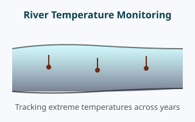

<!-- End of metadata -->

<!-- .slide:id="requirements" -->
## Requirements
- Mean Values
- Variance

---

<!-- .slide:id="quantiles-intro" -->
## Introduction to Quantiles

<div style="text-align: center; margin-bottom: 10px;">
  <button id="btn-raw-data" class="view-btn active" style="padding: 8px 16px; margin: 0 6px; background: #1a2340; color: #9efcff; border: 2px solid #9efcff; border-radius: 6px; cursor: pointer; font-size: 0.9em; font-weight: 600;">Raw Data</button>
  <button id="btn-mean-sd" class="view-btn" style="padding: 8px 16px; margin: 0 6px; background: #1a2340; color: #9efcff; border: 2px solid #555; border-radius: 6px; cursor: pointer; font-size: 0.9em; font-weight: 600;">Mean ± SD</button>
  <button id="btn-quantiles" class="view-btn" style="padding: 8px 16px; margin: 0 6px; background: #1a2340; color: #9efcff; border: 2px solid #555; border-radius: 6px; cursor: pointer; font-size: 0.9em; font-weight: 600;">Quantiles</button>
</div>
<div id="quantiles-intro-container" style="width: 100%; height: 820px;"></div>

<script>
(function() {
  // Lazy load the external plot script
  const loadPlot = () => {
    if (window.initQuantilesIntro) {
      window.initQuantilesIntro();
      return;
    }
    
    const script = document.createElement('script');
    script.src = '../resources/figures/quantiles-intro-plot.js';
    script.onload = () => {
      if (window.initQuantilesIntro) {
        window.initQuantilesIntro();
      }
    };
    document.head.appendChild(script);
  };

  if (document.readyState === 'loading') {
    document.addEventListener('DOMContentLoaded', loadPlot);
  } else {
    loadPlot();
  }
})();
</script>

---

<!-- .slide:id="quantiles-definition" -->
## Definition of Quantiles
<!-- layout={rows: 1, columns: 2} -->
<!-- position={row: 1, column: 1} -->

What are **Quantiles?**

-! Quantiles divide a sorted dataset into equal-sized groups
-: Median (Q2): the value separating the lower 50% from the upper 50%
-: Quartiles: Q1 (25%), Q2 (50%), Q3 (75%)
-: Percentiles: divide data into 100 parts (e.g., 90th percentile)

***

-! *Key idea*: Instead of "What's the average?" ask "What value is exceeded by only X% of samples?"

<!-- /position -->
<!-- position={row: 1, column: 2} -->
-! Base for quantile estimation is the `sorted` data list
-: e.g., `[3, 7, 8, 12, 13, 14, 18, 21, 23, 27]`

***

-! The positions in the sorted lists are indicated as brackets indexes
-: e.g., $x_{(1)}$ is the smallest value, $x_{(n)}$ the largest

***

-! Important:
$$ x_{(k)} : \text{value at position } k \text{ in sorted list} $$
$$ x_{k} : \text{value at position } k \text{ in original list} $$

<!-- /position -->
<!-- /layout -->

---

<!-- .slide:id="quantiles-definition-2" -->
## Definition of Quantiles II
<!-- layout={rows: 1, columns: 2} -->
<!-- position={row: 1, column: 1} -->
-! The general approach for percentile estimation requires two steps:

1. Estimation of the index $k$
$$ k = p \cdot (n + 1) $$
-: $k$ : index in the sorted data list
-: $p$ : probability of choice, e.g., 0.25 for 25% quantile
-: $n$ : number of data points

***

*Example*
-: $p = 0.4$, $n = 46$
$$k = 0.4 \cdot (46+1) = 18.8$$
<!-- /position -->
<!-- position={row: 1, column: 2} -->
2. Extract `or` Interpolate the value at $x_{(k)}$
*If* $k$ is an `Integer`, e.g., `k=7`, **direct** extraction is possible:
$$P\_{p} = x\_{(k)}$$

***

*Example*: 
$$P\_{0.4} = x\_{(7)} = 42.42$$
-= Interpretation: 40 % of data points are smaller than 42.42.

<!-- /position -->
<!-- /layout -->

---

<!-- .slide:id="quantiles-definition-3" -->
## Definition of Quantiles III
<!-- layout={rows: 1, columns: 2} -->
<!-- position={row: 1, column: 1} -->
*Else*, the values requires interpolation as follows:
$$P\_{p} = x_{(\lfloor k \rfloor)} + (k - \lfloor k \rfloor) \cdot (x_{(\lceil k \rceil)} - x_{(\lfloor k \rfloor)}) $$
-: $\lfloor x \rfloor$ : round to next lower integer, e.g., $\lfloor 4.7 \rfloor = 4$
-: $\lceil x \rceil$ : round to next upper integer, e.g., $\lceil 4.7 \rceil = 5$
<!-- /position -->
<!-- position={row: 1, column: 2} -->
*Example*
-: $k=18.8$
$$ P_{0.4} =  x_{(18)} + (18.8 - 18) \cdot (x_{(19)} - x_{(18)}) $$
$$ P_{0.4} = 76 + 0.8 \cdot (84 - 76) = 82.4 $$
-= Interpretation: 40 % of data points are smaller than 82.4.
<!-- /position -->
<!-- /layout -->

---

<!-- .slide:id="quantiles-group-activity-1" -->
## Let's create a Quantile Pipe 
<!-- layout={rows: 1, columns: 2} -->
<!-- position={row: 1, column: 1} -->
Let's create our own program in R that calculates a quantile of choice for a given dataset.

***

-! Useful functions:
-: `length()` : returns the number of data points
-: `floor()` : returns the next lower integer
-: `ceil()` : returns the next upper integer
-: `x[k]` : return the k-th value from the data set x 
-: `|>` : pipe operator: input left & applies function right
-: `print()` : returns a visible output 

***

```r
# Example pipe for geometric mean:
data <- c(8, 8, 7.2, 1.8, 21.8)
data |> log() |> mean() |> exp() |> print()
```

<!-- /position -->
<!-- position={row: 1, column: 2} -->
<!-- /position -->
<!-- /layout -->

---

<!-- .slide:id="iqr-robustness" -->
## Interquartile Range (IQR) - Robust Spread
<!-- layout={rows: 1, columns: 2} -->
<!-- position={row: 1, column: 1} -->


**Why IQR?**

-! **IQR = Q3 − Q1** (the middle 50% of data)
-! **Robust to outliers**: extreme values don't affect it
-! **Standard Deviation** is sensitive to every value, especially outliers

***

-: IQR is preferred when data contain anomalies or extreme events
-: Common in environmental monitoring with sensor noise or storm events

<!-- /position -->
<!-- position={row: 1, column: 2} -->
<div id="iqr-robustness-container"></div>

<script>
(function() {
  const initIQRRobust = async () => {
    const code = `# Dataset without outliers
clean <- c(20, 22, 24, 25, 26, 28, 30, 32, 34, 36)

# Dataset with outliers
with_outliers <- c(20, 22, 24, 25, 26, 28, 30, 32, 34, 120)

comparison <- data.frame(
  Dataset = c("Clean", "With Outlier"),
  SD = c(sd(clean), sd(with_outliers)),
  IQR = c(IQR(clean), IQR(with_outliers))
)

print(round(comparison, 2))

cat("\\nNotice: SD increases drastically with the outlier,\\nbut IQR remains stable!")`;

    const fallback = () => `[Simulated]
     Dataset    SD  IQR
1      Clean  5.68 10.0
2 With Outlier 29.41 10.0

Notice: SD increases drastically with the outlier,
but IQR remains stable!`;

    await window.webRHelper.initInteractiveSection({
      containerId: 'iqr-robustness-container',
      code: code,
      slideId: 'iqr-robustness',
      fallback: fallback,
      runLabel: 'Compare IQR vs SD',
      minHeight: '200px'
    });
  };

  if (document.readyState === 'loading') {
    document.addEventListener('DOMContentLoaded', initIQRRobust);
  } else {
    initIQRRobust();
  }
})();
</script>

<!-- /position -->
<!-- /layout -->

---

<!-- .slide:id="quantiles-application" -->
## Application: Comparing Peak River Temperatures
<!-- layout={rows: 1, columns: 2} -->
<!-- position={row: 1, column: 1} -->


**Climate Impact Assessment**

-! River temperature monitored daily over 25 years
-! Goal: Track **90th percentile** temperatures to detect warming trends
-! Why 90th percentile? Captures extreme heat events critical to aquatic life

***

-? Are extreme temperatures increasing over time?

<!-- /position -->
<!-- position={row: 1, column: 2} -->
<div id="quantiles-application-container"></div>

<script>
(function() {
  const initQuantilesApp = async () => {
    const code = `set.seed(456)
years <- 2000:2024
p90_temps <- 18 + 0.08 * (years - 2000) + rnorm(25, 0, 0.5)

par(mar = c(4, 4, 2, 1))
barplot(p90_temps, names.arg = years, col = "#1a2340", 
        border = "#9efcff", ylim = c(0, 25),
        xlab = "Year", ylab = "90th Percentile Temp (°C)",
        main = "Extreme River Temperatures (1990-2024)",
        las = 2, cex.names = 0.7)
abline(h = 20, col = "#702914", lwd = 2, lty = 2)
text(12, 21, "Critical Threshold (20°C)", col = "#702914", cex = 0.8)

# Add trend line
fit <- lm(p90_temps ~ years)
abline(fit, col = "#09414d", lwd = 2)`;

    const fallback = () => '[Visualization unavailable offline]';

    await window.webRHelper.initInteractiveSection({
      containerId: 'quantiles-application-container',
      code: code,
      slideId: 'quantiles-application',
      fallback: fallback,
      runLabel: 'Show Temperature Trends',
      minHeight: '320px'
    });
  };

  if (document.readyState === 'loading') {
    document.addEventListener('DOMContentLoaded', initQuantilesApp);
  } else {
    initQuantilesApp();
  }
})();
</script>

<!-- /position -->
<!-- /layout -->

---

<!-- .slide:id="boxplots-intro" -->
## Boxplots for Water Quality Data
<!-- layout={rows: 1, columns: 2} -->
<!-- position={row: 1, column: 1} -->


**Reading Boxplots**

-! **Box**: spans from Q1 to Q3 (IQR)
-! **Line inside box**: median (Q2)
-! **Whiskers**: extend to min/max within 1.5×IQR
-! **Points beyond whiskers**: potential outliers

***

-: Boxplots summarize distribution shape, spread, and outliers at a glance
-: Ideal for comparing multiple sites or time periods

<!-- /position -->
<!-- position={row: 1, column: 2} -->
<div id="boxplots-intro-container"></div>

<script>
(function() {
  const initBoxplotsIntro = async () => {
    const code = `set.seed(789)
# Nitrate concentrations from three sampling sites
siteA <- rnorm(50, mean = 30, sd = 5)
siteB <- rnorm(50, mean = 40, sd = 8)
siteC <- c(rnorm(45, mean = 25, sd = 4), rnorm(5, mean = 70, sd = 5))

data <- data.frame(
  NO3 = c(siteA, siteB, siteC),
  Site = rep(c("Site A", "Site B", "Site C"), each = 50)
)

par(mar = c(4, 4, 2, 1))
boxplot(NO3 ~ Site, data = data, 
        col = c("#1a2340", "#09414d", "#9efcff"),
        border = "#702914",
        ylab = "NO3 (mg/L)", 
        main = "Nitrate Levels Across Sites")
abline(h = 50, col = "#702914", lwd = 2, lty = 2)
text(2.5, 52, "EU Threshold", col = "#702914", cex = 0.8)`;

    const fallback = () => '[Visualization unavailable offline]';

    await window.webRHelper.initInteractiveSection({
      containerId: 'boxplots-intro-container',
      code: code,
      slideId: 'boxplots-intro',
      fallback: fallback,
      runLabel: 'Show Boxplots',
      minHeight: '320px'
    });
  };

  if (document.readyState === 'loading') {
    document.addEventListener('DOMContentLoaded', initBoxplotsIntro);
  } else {
    initBoxplotsIntro();
  }
})();
</script>

<!-- /position -->
<!-- /layout -->

---

<!-- .slide:id="quantiles-in-r" -->
## Quantiles in R
<!-- layout={rows: 1, columns: 2} -->
<!-- position={row: 1, column: 1} -->
**Using the `quantile()` Function**

-! R provides `quantile()` to calculate any percentile
-! Default method: `type = 7` (linear interpolation)
-! Other software (Excel, Python) may use different methods

***

**Syntax:**
```r
quantile(x, probs = c(0.25, 0.5, 0.75))
```

-: `x`: numeric vector
-: `probs`: probabilities (0 to 1)

***

-! Always document which method you use for reproducibility

<!-- /position -->
<!-- position={row: 1, column: 2} -->
<div id="quantiles-in-r-container"></div>

<script>
(function() {
  const initQuantilesR = async () => {
    const code = `# Phosphate measurements (PO4 in mg/L)
PO4 <- c(0.12, 0.08, 0.10, 0.09, 0.35, 0.11, 0.13, 0.07, 0.10, 0.09)

cat("Data:", paste(PO4, collapse = ", "), "\\n\\n")

# Calculate quartiles
quartiles <- quantile(PO4, probs = c(0.25, 0.5, 0.75))
print(quartiles)

cat("\\n90th percentile:", quantile(PO4, 0.90), "mg/L\\n")

# Compare different methods
cat("\\nType 7 (R default):", quantile(PO4, 0.5, type = 7), "\\n")
cat("Type 1 (inverse CDF):", quantile(PO4, 0.5, type = 1), "\\n")`;

    const fallback = () => `[Simulated]
Data: 0.12, 0.08, 0.10, 0.09, 0.35, 0.11, 0.13, 0.07, 0.10, 0.09

  25%   50%   75% 
0.090 0.105 0.120 

90th percentile: 0.226 mg/L

Type 7 (R default): 0.105 
Type 1 (inverse CDF): 0.1`;

    await window.webRHelper.initInteractiveSection({
      containerId: 'quantiles-in-r-container',
      code: code,
      slideId: 'quantiles-in-r',
      fallback: fallback,
      runLabel: 'Run quantile()',
      minHeight: '240px'
    });
  };

  if (document.readyState === 'loading') {
    document.addEventListener('DOMContentLoaded', initQuantilesR);
  } else {
    initQuantilesR();
  }
})();
</script>

<!-- /position -->
<!-- /layout -->

---

<!-- .slide:id="boxplot-in-r" -->
## Boxplot in R
<!-- layout={rows: 1, columns: 2} -->
<!-- position={row: 1, column: 1} -->
**Using the `boxplot()` Function**

-! R provides `boxplot()` to visualize distributions
-! Can compare multiple groups with formula notation

***

**Syntax:**
```r
boxplot(value ~ group, data = df)
```

-: Horizontal boxplot: `horizontal = TRUE`
-: Customize colors: `col`, `border`

***

-! Click "Generate Boxplot" to create an interactive visualization →

<!-- /position -->
<!-- position={row: 1, column: 2} -->
<div id="boxplot-in-r-container"></div>

<script>
(function() {
  const initBoxplotR = async () => {
    const code = `# Temperature data from three monitoring stations
set.seed(2025)
temps <- data.frame(
  Temp = c(rnorm(30, 18, 2), rnorm(30, 20, 3), rnorm(30, 16, 1.5)),
  Station = rep(c("Upstream", "Midstream", "Downstream"), each = 30)
)

par(mar = c(4, 4, 2, 1))
boxplot(Temp ~ Station, data = temps,
        col = c("#1a2340", "#09414d", "#9efcff"),
        border = "#702914",
        ylab = "Temperature (°C)",
        main = "River Temperature by Station",
        las = 1)

# Add mean points
means <- tapply(temps$Temp, temps$Station, mean)
points(1:3, means, pch = 23, bg = "#702914", cex = 1.5)
legend("topright", legend = "Mean", pch = 23, pt.bg = "#702914", cex = 0.8)`;

    const fallback = () => '[Click "Generate Boxplot" to create visualization]';

    await window.webRHelper.initInteractiveSection({
      containerId: 'boxplot-in-r-container',
      code: code,
      slideId: 'boxplot-in-r',
      fallback: fallback,
      runLabel: 'Generate Boxplot',
      minHeight: '320px',
      plotOnDemand: true
    });
  };

  if (document.readyState === 'loading') {
    document.addEventListener('DOMContentLoaded', initBoxplotR);
  } else {
    initBoxplotR();
  }
})();
</script>

<!-- /position -->
<!-- /layout -->

